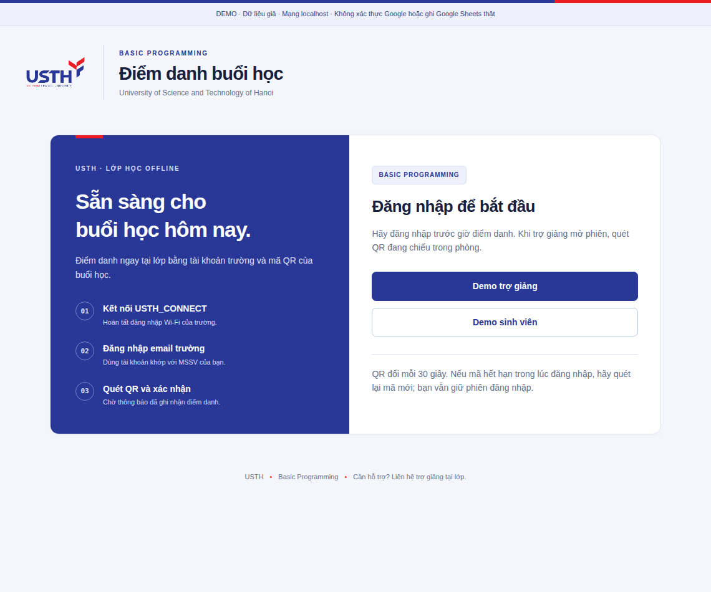

<p align="center"></p>

# BP Attendance · USTH

Điểm danh môn **Basic Programming** trên laptop host tại lớp. TA đăng nhập và bấm **Mở QR điểm danh**. Sinh viên dùng điện thoại quét QR hoặc mở website trên máy tính và nhập mã đang chiếu. Kết quả lưu vào SQLite rồi tự đồng bộ Google Sheets, mỗi ngày học một cột.

Laptop host và sinh viên kết nối **USTH_CONNECT**. Mọi lượt gửi đều qua kiểm tra Google của trường, danh sách MSSV–email, mạng được phép và thời hạn phiên. QR và mã 8 ký tự đổi cùng nhau mỗi **30 giây**.



## Tài liệu sử dụng

| Người sử dụng | Hướng dẫn |
| --- | --- |
| Chuẩn bị ở nhà, ngày mai thử tại trường | **[Chuẩn bị trước buổi học](docs/PREPARE-BEFORE-CLASS.vi.md)** |
| TA đứng lớp | **[Thao tác từng bước, có ảnh](docs/TA-GUIDE.vi.md)** |
| TA phụ trách laptop host | **[Cài đặt và chạy ứng dụng](docs/HOST-QUICKSTART.vi.md)** |
| Người cấu hình Google / Sheets | [Thông số và thiết lập tài khoản](docs/WEB-SETUP.vi.md) |
| Người kiểm tra mạng tại trường | [LAN, DNS, HTTPS, firewall, giữ laptop hoạt động](docs/LAPTOP-LAN.vi.md) |
| Người nghiệm thu | [Kết quả đo tải](docs/LOAD-TEST.vi.md) · [Phạm vi kiểm tra](docs/WEB-VALIDATION.md) · [Căn cứ điểm danh](docs/ANTI-PROXY.vi.md) |

## Cài đặt trên laptop host

Cần **Node.js 24+, Git, Python 3** và Caddy cho HTTPS. Hướng dẫn dịch vụ tự khởi động lại dành cho Linux/systemd.

```bash
git clone https://github.com/namle24/bp-attendance.git
cd bp-attendance
npm ci
npm run caddy:install
npm run laptop:setup
npm run host:install
```

Điền `.env` theo [hướng dẫn cấu hình](docs/WEB-SETUP.vi.md): URL HTTPS, OAuth client, domain Google của trường, email TA, CIDR mạng, QR secret, Sheet và đường dẫn credentials. Thiết lập DNS/chứng chỉ và [Caddyfile LAN](deploy/Caddyfile.lan) trước khi cho sinh viên truy cập.

```bash
npm run host:check -- --campus
npm run host:start
```

`host:check` kiểm tra cấu hình, credentials, chứng chỉ và IP trước khi bật dịch vụ. `host:start` bật app và Caddy theo user hiện tại. Node chỉ nghe `127.0.0.1:4180`; sinh viên mở **URL HTTPS chung có cổng 8443** qua Caddy. `localhost` trên điện thoại không phải laptop host.

`npm run host:status` xem trạng thái; `npm run host:stop` dừng sau khi đồng bộ/backup. Mỗi lớp dùng một database chung. Hướng dẫn chi tiết: [chuẩn bị từ nhà và test ở trường](docs/PREPARE-BEFORE-CLASS.vi.md).

**Tình trạng nghiệm thu:** đã kiểm thử cục bộ; chưa có cấu hình Google/HTTPS của lớp và chưa nghiệm thu trên Wi‑Fi USTH. Cần hoàn tất các mục này trước khi thu điểm danh chính thức.

## Mỗi buổi học

1. Người host bật app/Caddy, kiểm tra kết nối và Sheets. Danh sách lớp đầy đủ đã nhập trước buổi đầu.
2. TA và sinh viên mở URL chung, đăng nhập Google trường. TA bấm **Mở QR điểm danh**; app chuyển thẳng sang màn chiếu, mặc định mở 8 phút.
3. **Điện thoại:** quét QR → bấm **Xác nhận điểm danh**. **Máy tính:** mở URL dưới QR → nhập mã 8 ký tự → bấm **Điểm danh**.
4. Sinh viên chờ **Đã ghi nhận điểm danh**. Thông báo này xác nhận bản ghi đã lưu; gửi lại không tạo bản ghi trùng.
5. Phiên tự đóng khi hết giờ. TA kiểm tra Sheets, xử lý ngoại lệ và người host backup trước khi dừng app.


| Màn TA | Sinh viên trên điện thoại |
| --- | --- |
| [](docs/web-admin.png) | [](docs/web-student.png) |

Xem thêm [màn máy tính](docs/web-student-desktop.png) và [nhập danh sách lớp](docs/web-roster.png). Ảnh được tạo trong kiểm thử giao diện bằng tài khoản hư cấu; [cách chụp và phạm vi](docs/BRANDING.md).

## Kết quả và vận hành

| Ký hiệu | Ý nghĩa |
| --- | --- |
| `OFF` | Offline hợp lệ hoặc TA điều chỉnh |
| `ON` | Online do TA nhập sau đối chiếu |
| `BOTH` | Có cả hai hình thức trong cùng ngày; cần đối chiếu |
| `V` / `EXCUSED` | TA xác nhận vắng / có phép |
| Ô trống | Chưa ghi nhận, chưa kết luận vắng |

Sheets đồng bộ theo lô khoảng 15 giây khi có thay đổi; lỗi kết nối sẽ được thử lại. Buổi kế tiếp tạo cột ngày mới khi TA mở phiên, không tự tạo cột cho ngày không học. Mỗi ngày một phiên offline, không mở lại phiên đã đóng; ngoại lệ dùng **Điều chỉnh có lý do**. Chưa kết nối tự động Zoom/Meet. Nút tải trong app xuất CSV; cần `.xlsx` thì xuất từ Google Sheets.

Cùng SSID chưa bảo đảm thiết bị sinh viên truy cập được laptop. Cần thử LAN và nhờ IT xác nhận CIDR CONNECT, cách tách Guest/VPN, DNS và HTTPS. QR/mã ngắn hạn cùng Google/mạng trường hạn chế chuyển tiếp từ ngoài trường nhưng chưa chứng minh đúng người hoặc đúng phòng; giảng viên chốt cách đối chiếu thẻ và xử lý ngoại lệ.

## Kiểm tra và mã nguồn

```bash
npm test
npm run check
npm run bench:web
```

Bộ kiểm thử gồm xác thực, QR/mã nhập, 700 tài khoản cùng IP, lỗi Sheets, backup và phục hồi sau SIGKILL. Kiểm tra trình duyệt gồm điện thoại, laptop, trình chiếu, đổi mã và mất kết nối trước/sau khi ghi. Các phép đo cục bộ không thay thế nghiệm thu Wi‑Fi/Google/HTTPS tại trường; xem [số liệu và giới hạn](docs/LOAD-TEST.vi.md).

```text
web/              Server, Google, QR/mã nhập, SQLite, Sheets
web/public/       Giao diện USTH, logo và bộ tạo QR cục bộ
deploy/           Caddy và mẫu service
scripts/          Kiểm tra cấu hình, thử LAN, backup, đo tải, chụp ảnh
docs/             Hướng dẫn TA/host, ảnh và báo cáo
examples/         CSV chỉ có tiêu đề để nhập danh sách chính thức
tests/            Kiểm thử cô lập; không dùng dữ liệu lớp
```

`.env`, database, backup và credentials được Git bỏ qua. Dữ liệu thử chỉ được tạo bởi bộ kiểm thử trong database riêng; ứng dụng khởi động với danh sách lớp trống. Logo/màu tham chiếu từ tài liệu được cung cấp: [tài nguyên giao diện](docs/BRANDING.md).
