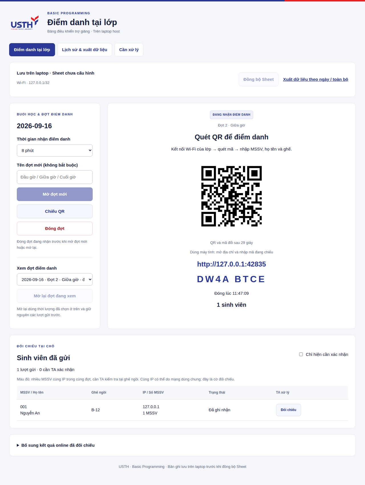

<p align="center"></p>

# BP Attendance · USTH

Điểm danh offline trên **Windows, macOS và Linux**, laptop host cùng Wi-Fi với sinh viên. Chạy `npm start`, app tự chuẩn bị dữ liệu và mở trang TA. TA bấm **Mở QR điểm danh**; QR và mã cho máy tính đổi mỗi **30 giây**. Sinh viên quét mã rồi nhập **MSSV, họ tên, vị trí ngồi**.

Kết quả được lưu vào SQLite trước khi trả thông báo thành công. Google Sheets đồng bộ sau, khoảng 15 giây mỗi đợt có thay đổi. Chưa cấu hình Sheets vẫn dùng được app và tải CSV để mở bằng Excel.

**Tra cứu cho sinh viên:** mở **Tra cứu MSSV** để xem kết quả từ tab Google Sheet do TA sửa trực tiếp. TA dán link đúng tab tại **Lịch sử & xuất dữ liệu**; app đọc mỗi phút, hiển thị thời điểm đọc và cảnh báo nếu dữ liệu chưa cập nhật. Xem [hướng dẫn kết nối và sử dụng](docs/STUDENT-LOOKUP.vi.md).

**Đối chiếu vị trí tùy chọn:** TA đặt tâm lớp và bán kính cho đợt mới; ngoài phạm vi hoặc chưa xác minh được sẽ cần TA đối chiếu. App vẫn host trên laptop; một trang HTTPS tĩnh hỗ trợ xin quyền vị trí trên điện thoại và cần được xuất bản một lần. Mặc định tính năng tắt. Xem [hướng dẫn vị trí và giới hạn](docs/LOCATION-CHECK.vi.md).

**Nhiều MSSV cùng IP trong một đợt:** tất cả bản ghi liên quan được tô đỏ trên bảng TA, tab chi tiết và ô ngày tương ứng của bảng tổng. TA kiểm tra người/thẻ tại ghế ngồi rồi lưu xác nhận trên app. Cùng IP chỉ là cờ đối chiếu; các thiết bị chung NAT có thể cùng IP và một người có thể dùng nhiều IP.


## Chạy trên laptop

**Giảng viên/TA dùng Windows:** xem [hướng dẫn từng bước](docs/WINDOWS.vi.md) để cập nhật bản cũ hoặc cài lần đầu, mở app, chiếu QR qua HDMI và xuất Excel. Nếu đã có repo, dừng app rồi chạy `git pull --ff-only` và `npm start`; các buổi sau có thể nhấp đúp **Start-Windows.bat**.

Cài **Node.js 24+** một lần. Trong thư mục repo, chạy:

```text
npm start
```

Lần đầu app tự cài thư viện nếu thiếu (cần Internet), tạo cấu hình và database. Các buổi sau dùng lại lệnh này. Không cần điền `.env`, cài service, Google OAuth hay chứng chỉ để điểm danh LAN.

| Hệ điều hành | Có thể mở bằng file |
| --- | --- |
| Windows | Nhấp đúp `Start-Windows.bat` |
| macOS | Mở `Start-macOS.command`, hoặc dùng `npm start` trong Terminal |
| Linux | Chạy `./start-linux.sh`, hoặc `npm start` |

App tự nhận card Wi-Fi bằng thông tin của hệ điều hành. Nếu chưa xác định được một kết nối duy nhất, trang **Chọn mạng của lớp** mở ra: bấm vào mạng đang dùng. Khi đổi mạng, app lấy IP hiện tại ở lần khởi động mới. Không phải sửa cấu hình thủ công cho luồng mặc định.


- **TA:** trình duyệt tự mở `http://127.0.0.1:4181`; bấm **Mở QR điểm danh** khi lớp sẵn sàng. Bật app không tự tiêu tốn phiên trong ngày.
- **Trình chiếu:** QR mở trong tab riêng, có nút **Toàn màn hình**; Esc để thoát. Bảng TA vẫn dùng được để theo dõi và đối chiếu. Nút **Chiếu QR** đưa bạn về tab chiếu hoặc mở lại nếu đã đóng. Có thể kéo tab này sang màn hình máy chiếu.
- **Sinh viên:** quét QR đang chiếu; máy tính mở URL được chiếu và nhập mã 8 ký tự hiện tại. Quét/nhập mã hợp lệ có tối đa 3 phút điền form, không vượt giờ đóng phiên.
- **Dừng:** Ctrl+C trong cửa sổ chạy app. Giữ cửa sổ mở, cắm sạc và giữ máy thức. Luồng chung chạy trực tiếp; dịch vụ Linux nâng cao nằm trong hướng dẫn host.

Cập nhật bản đã clone: dừng cửa sổ app, chạy `git pull --ff-only`, rồi `npm start`. Nếu đang dùng dịch vụ Linux của bản cũ, dừng bằng `npm run service:stop` sau khi cập nhật. Dữ liệu và `.env` cũ được giữ nguyên.

**Tại trường vẫn phải thử điện thoại thật.** Cùng Wi-Fi chưa bảo đảm thiết bị được kết nối tới laptop: client isolation, VLAN hoặc firewall có thể chặn. App không đọc được SSID hoặc tài khoản captive portal của sinh viên. Bản LAN dùng HTTP, dữ liệu truyền chưa mã hóa; cần sử dụng theo yêu cầu mạng của trường. Trang quản lý chỉ nghe trên localhost, không cung cấp qua Wi-Fi.

## Hướng dẫn TA và host

| Việc cần làm | Tài liệu |
| --- | --- |
| Chuẩn bị ở nhà và thử tại trường | [Chuẩn bị trước buổi học](docs/PREPARE-BEFORE-CLASS.vi.md) |
| Mở QR, xem bản ghi đỏ, xác nhận | [Hướng dẫn TA có ảnh](docs/TA-GUIDE.vi.md) |
| Máy Windows của giảng viên/TA | [Windows: cài đặt, cập nhật, chạy và chiếu QR](docs/WINDOWS.vi.md) |
| Cài đặt, chạy, dừng, backup | [Hướng dẫn máy host](docs/HOST-QUICKSTART.vi.md) |
| Bật Google Sheets và hiểu các cột | [Cấu hình Sheets](docs/WEB-SETUP.vi.md) |
| Sinh viên tra cứu kết quả TA sửa trên Sheet | [Tra cứu bằng MSSV](docs/STUDENT-LOOKUP.vi.md) |
| Đặt tâm lớp, bán kính và đối chiếu vị trí | [Kiểm tra vị trí](docs/LOCATION-CHECK.vi.md) |
| Xử lý mạng trường | [Wi-Fi / LAN](docs/LAPTOP-LAN.vi.md) |
| Căn cứ ghi nhận và giới hạn IP | [Đối chiếu điểm danh](docs/ANTI-PROXY.vi.md) |
| Khả năng chịu tải | [Kết quả đo](docs/LOAD-TEST.vi.md) · [Phạm vi kiểm thử](docs/WEB-VALIDATION.md) |


| Biểu mẫu sinh viên | Sau khi lưu thành công |
| --- | --- |
|  |  |

Ảnh chụp qua kiểm thử trình duyệt với dữ liệu hư cấu trong database tạm, không đưa vào database lớp. IP localhost/cổng ngẫu nhiên trong ảnh là địa chỉ của kiểm thử; sinh viên thật dùng IP Wi-Fi được máy host in ra.

## Lịch sử theo ngày và danh sách cần xử lý

Trang TA có ba màn: **Điểm danh tại lớp**, **Lịch sử & xuất dữ liệu**, **Cần xử lý**.

**Một ngày học có thể có nhiều đợt điểm danh:** đầu giờ, giữa giờ, cuối giờ. Đóng đợt đang nhận, nhập tên nếu muốn, rồi bấm **Mở đợt mới** để tất cả sinh viên quét QR và gửi lại. Chọn một đợt của hôm nay trong **Xem đợt điểm danh** rồi bấm **Mở lại đợt đang xem** để nhận bổ sung mà giữ nguyên các lượt đã gửi. Mỗi thời điểm chỉ có một đợt đang nhận.

Bảng tổng vẫn có **một cột mỗi ngày**. Khi có nhiều đợt, ô ghi **Đã gửi 2/3 đợt**, kèm số lượt cần xác nhận/không xác nhận nếu có; TA quyết định kết quả cuối buổi. Đây là số đợt đã gửi, không tự kết luận có mặt cả buổi hoặc vắng. CSV chi tiết và tab `BP_Offline_Check` có thêm số đợt, tên đợt và mã đợt.



- **Lịch sử & xuất dữ liệu:** chọn một ngày hoặc **Tất cả các ngày**, xem các lượt gửi offline và tải bảng tổng/chi tiết CSV. Bảng tổng theo ngày chỉ có một cột ngày và các MSSV có kết quả ngày đó; bản toàn bộ giữ đủ cột của các buổi. Tên file chứa ngày hoặc `all`.
- **Cần xử lý:** danh sách các bản ghi chờ đối chiếu hoặc TA không xác nhận. Lọc theo ngày và trạng thái, xem ghế/IP/lý do, lưu đối chiếu trực tiếp hoặc tải danh sách CSV theo đúng bộ lọc.
- Dữ liệu các ngày cùng lưu trong SQLite trên laptop, giữ nguyên khi khởi động lại. Xem/xuất không sửa dữ liệu gốc hoặc phạm vi đồng bộ Sheet. Bản ghi đã được xác nhận có mặt rời danh sách cần xử lý và vẫn có trong lịch sử.


CSV mở được bằng Excel nhưng không giữ màu; cột trạng thái, lý do và ghi chú vẫn được xuất đầy đủ trong báo cáo chi tiết/danh sách cần xử lý. Bảng tổng có cả kết quả online đã nhập; màn lịch sử và CSV chi tiết hiển thị lượt gửi offline của luồng LAN.

## Kết quả và xác nhận

| Kết quả tại một ngày học | Ý nghĩa |
| --- | --- |
| `OFF` | Đã ghi nhận offline; thông tin tự khai hoặc TA đã đối chiếu, xem tab chi tiết |
| `OFF cần xác nhận` + nền đỏ | Trùng IP trong cùng đợt, đang chờ TA đối chiếu |
| `OFF không được xác nhận` | TA đã kiểm tra và không xác nhận, có ghi chú |
| `ON` | Online đã được TA bổ sung sau đối chiếu |
| `BOTH` | Có offline và online cùng ngày, cần đối chiếu cách tính |
| `ON · OFF cần xác nhận` + nền đỏ | Online đã bổ sung; offline còn chờ TA |
| Ô trống | Chưa ghi nhận, chưa kết luận vắng |
| `Đã gửi 2/3 đợt` | Ngày có nhiều đợt: đã gửi ở hai đợt; TA quyết định kết quả cuối cùng |
| `Đã gửi 2/3 đợt · 1 cần xác nhận` + nền đỏ | Có lượt trùng IP chưa được TA đối chiếu; không tự coi là hợp lệ |

`BP_Web_Attendance`: bảng tổng, mỗi ngày học một cột. `BP_Offline_Check`: họ tên đã nhập, ghế, IP, số MSSV cùng IP, trạng thái và ghi chú TA. Bấm **Đối chiếu** trên app để cập nhật; không sửa trực tiếp hai tab do app quản lý vì lần đồng bộ sau sẽ ghi lại dữ liệu. Sheet tổng do lớp tự quản lý có thể đặt ở tab khác.

Mỗi đợt mặc định 8 phút, tùy chọn 5–30 phút. Đợt đóng/hết giờ có thể được mở lại trong cùng ngày với thời lượng mới. QR và quyền gửi chưa dùng từ trước khi mở lại đều bị vô hiệu hóa; sinh viên phải quét mã mới. Người đã gửi trong đợt đó vẫn chỉ có một bản ghi. **Đợt mới** cho phép cùng MSSV gửi lại bằng một lượt quét mới. Retry của lượt cũ chỉ trả biên nhận đợt cũ, không điểm danh thay cho đợt mới. IP được lấy từ kết nối trực tiếp, bỏ qua IP tự khai và các header chuyển tiếp.

Khi nâng cấp từ bản một phiên/ngày, dữ liệu cũ được giữ làm **đợt 1**. Nếu database đã có buổi học, app tự tạo bản sao SQLite `*.before-rounds-*.sqlite` bên cạnh file gốc trước khi chuyển đổi. Không cần xóa database hoặc nhập lại dữ liệu.

Nếu có người thứ ba dùng IP đã được đối chiếu, những bản ghi đã xác nhận trong nhóm sẽ trở lại trạng thái cần đối chiếu. Kết quả TA đã từ chối vẫn được giữ. Ghi chú và lịch sử xác nhận lưu trong database.

Online tiếp tục dùng Google Form riêng. Có thể tổng hợp thủ công ở tab khác; chức năng nhập online đã đối chiếu vẫn có trong mục mở rộng của trang TA. Không kết nối Zoom/Meet hoặc tự theo dõi sinh viên online.

## Kiểm tra mã nguồn

Ngày **16/09/2026**, đã thử thành công điểm danh từ một điện thoại thật trên USTH_CONNECT và đối chiếu bản ghi trong database thử. Trên laptop i5-9300H/RAM 8 GiB, ba lần chạy tải 700 sinh viên qua **hai đợt cùng ngày** đạt **12.600/12.600 request** gồm quét QR, gửi và gửi lại; mỗi đợt ghi điểm danh hoàn tất trong **3,05–4,14 giây**, không mất hoặc nhân đôi bản ghi. Phép đo tải dùng HTTP loopback, chưa đo Wi-Fi với 700 thiết bị. Xem [báo cáo và giới hạn phép đo](docs/LOAD-TEST.vi.md).

```bash
npm test
npm run check
npm run bench:web
```

Luồng hoạt động: `web/server.cjs` → `lan-config.cjs`, `lan-app.cjs`, `lan-store.cjs`, `lan-public/`. Module Google/QR cũ được giữ để kiểm thử và bảo toàn dữ liệu lịch sử; entry point hiện tại không phục vụ API đăng nhập Google.

`.env`, database, backup và credentials được Git bỏ qua. Giữ chung database qua các buổi; không xóa để mở buổi mới. [Logo và màu giao diện](docs/BRANDING.md).
