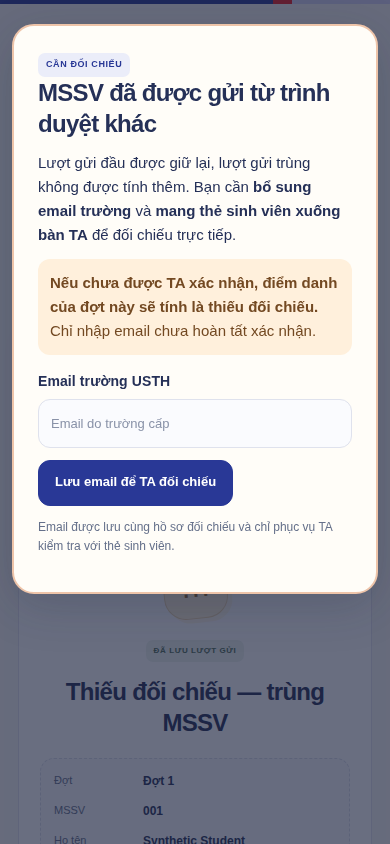
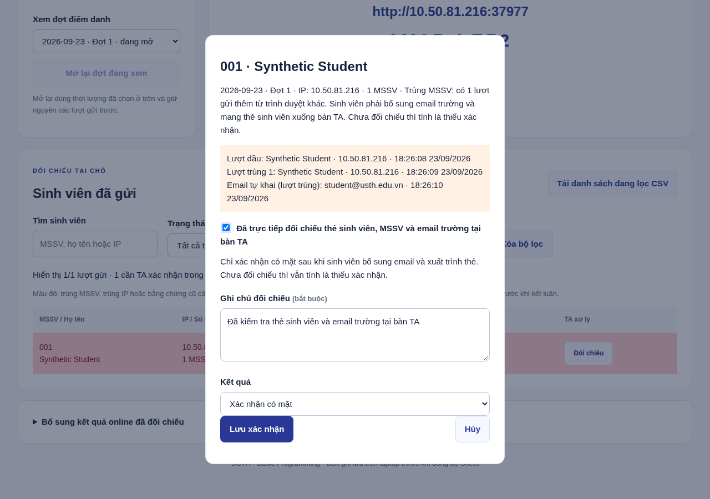

# Đối chiếu khi trùng MSSV · bản 0.9.1

Quy tắc áp dụng cho **từng đợt**. Cùng ngày có thể có đợt đầu, giữa và cuối giờ; mỗi đợt cho phép gửi một lần. Mở lại đợt cũ không xóa lượt đã gửi.

## Sinh viên

- Lượt đầu: quét QR, nhập MSSV và họ tên, gửi và xem biên nhận. Không yêu cầu email, vị trí hay hàng ghế.
- Cùng trình duyệt mở tab/quét lại: hiện biên nhận cũ. Bấm gửi lại sau khi mất mạng không tạo vi phạm hay bản ghi mới.
- Trình duyệt khác gửi cùng MSSV với QR còn hiệu lực: lượt sau bị chặn, bản ghi đầu được giữ và đánh dấu **Thiếu đối chiếu — trùng MSSV**.
- Popup yêu cầu nhập email do USTH cấp (`@usth.edu.vn` hoặc tên miền con của trường) và **mang thẻ sinh viên xuống bàn TA**. Không đối chiếu thì điểm danh đợt đó tính là thiếu xác nhận. Lưu email chưa đủ để xác nhận có mặt.
- Email được lưu riêng theo trình duyệt gửi, không ghi đè email trong danh sách lớp và không hiển thị email của người gửi khác. Đây là thông tin tự khai, không phải đăng nhập hoặc xác minh chủ sở hữu hộp thư. Nhập sai email thì báo TA đối chiếu và ghi chú.

Popup xuất hiện ngay trên máy gửi trùng. Máy gửi đầu đang mở biên nhận cập nhật sau khoảng 25–35 giây hoặc khi quay lại tab. Không thể hiện thông báo trên trình duyệt đã đóng; khi mở lại cùng trình duyệt trong ngày sẽ lấy kết quả lưu trên host. Biểu mẫu `/simple` không cần JavaScript vẫn có cảnh báo và ô email, cần bấm cập nhật để xem kết quả mới. Email vẫn bổ sung được khi đợt đã đóng. Khi đã chuyển sang đợt mới, giữ trang biên nhận cũ để hoàn tất đối chiếu đợt trước.

## TA

1. Mở **Cần xử lý**, chọn ngày/đợt và bộ lọc **Có lượt gửi trùng MSSV**. Ca chưa đối chiếu được tô đỏ; cũng thấy ở danh sách điểm danh và lịch sử.
2. Bấm **Đối chiếu** để xem lượt đầu, các lượt gửi trùng, họ tên tự khai, IP, thời gian và email bổ sung. Cùng hay khác IP đều có thể là gửi trùng MSSV; trùng IP giữa nhiều MSSV vẫn có cơ chế đối chiếu riêng.
3. Yêu cầu sinh viên mang thẻ xuống bàn TA. So khớp người, thẻ, MSSV và email trường; ghi rõ kết quả, cả trường hợp nhầm thông tin.
4. Muốn **Xác nhận có mặt**, hệ thống yêu cầu đã có ít nhất một email bổ sung cho hồ sơ và TA tích **Đã trực tiếp đối chiếu thẻ sinh viên, MSSV và email trường tại bàn TA**. Chưa đủ thì không lưu xác nhận. Có thể **Không xác nhận** kèm lý do nếu sinh viên không đến/không khớp.
5. Nếu có thêm lượt trùng trong lúc TA đang xem, app yêu cầu tải lại danh sách trước khi lưu. Ca đã xác nhận có mặt sẽ cần đối chiếu lại khi xuất hiện lượt trùng mới. Quyết định không xác nhận của TA được giữ.

## Sheet và CSV

Một MSSV vẫn có một bản ghi mỗi đợt. Tab chi tiết thêm **Số lượt trùng MSSV**, **Bằng chứng trùng MSSV** (IP/thời gian), **Email bổ sung (tự khai)**. Các cột lịch sử giữ nguyên vị trí. Bảng tổng ngày có một đợt ghi `OFF thiếu đối chiếu (trùng MSSV)`; ngày nhiều đợt có thể ghi `Đã gửi 2/3 đợt · 1 thiếu đối chiếu MSSV`. Ca chưa xử lý có màu đỏ trong các tab Sheet do app quản lý. CSV không giữ màu, giữ đầy đủ trạng thái và thông tin đối chiếu.

Đóng đợt không tự đổi ca chờ đối chiếu thành có mặt hoặc tự kết luận gian lận. TA chốt kết quả cuối; lượt online đã bổ sung và các đợt khác được giữ riêng trong tổng hợp. Tab tra cứu do TA sửa trực tiếp vẫn là nguồn tra cứu của sinh viên, không tự ghi đè tab đó.

## Cập nhật và kiểm tra

Dừng app bằng Ctrl+C, cập nhật mã đã được phát hành, rồi chạy `npm start`. Giữ nguyên thư mục `data` và `.env`; các bảng bằng chứng được thêm vào database, không xóa buổi học cũ. Sinh viên tải lại trang để nhận giao diện mới.

Kiểm tra trên database thử riêng trước buổi học: gửi một MSSV trên điện thoại, mở tab mới cùng trình duyệt phải hiện biên nhận; gửi cùng MSSV từ laptop/trình duyệt khác phải xuất hiện popup; bổ sung email, đối chiếu trên TA và kiểm tra trạng thái. Không tạo dữ liệu thử vào phiên đang điểm danh thật.

Cookie nhận diện trình duyệt, không chứng minh một thiết bị vật lý hay một con người. Đổi trình duyệt/xóa cookie/ẩn danh có thể tạo nhận diện mới. Email tự khai và cùng Wi-Fi không thay thế đối chiếu thẻ. Không thể cam kết mọi thiết bị đều kết nối được nếu mạng trường chặn liên lạc giữa thiết bị; xem [chẩn đoán điện thoại](MOBILE-ACCESS.vi.md).

Ảnh minh họa chụp từ database thử riêng, dùng dữ liệu hư cấu.
