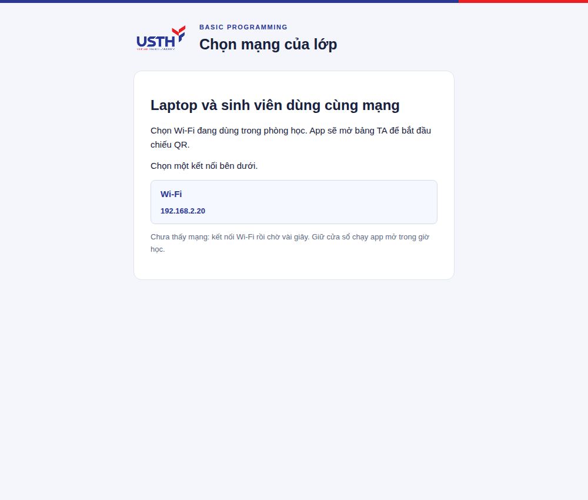

# Chạy BP Attendance trên Windows, macOS và Linux

## Mở app

Cài Node.js 24 trở lên một lần. Trong thư mục repo, chạy:

```text
npm start
```

Lần đầu cần Internet để app tự cài thư viện còn thiếu. App tự tạo `.env`, database và bí mật QR; giữ nguyên dữ liệu/cấu hình đã có. Các buổi sau dùng lại lệnh này. Không cần `host:install`, OAuth hoặc chứng chỉ cho luồng LAN.

Windows có thể nhấp đúp `Start-Windows.bat`. macOS mở `Start-macOS.command` (nếu hệ điều hành chặn mở file, dùng Terminal với `npm start`). Linux dùng `./start-linux.sh` hoặc `npm start`.

Trình duyệt mở trang TA trên laptop. Nếu app chưa xác định được một card Wi-Fi, trang **Chọn mạng của lớp** xuất hiện: chọn mạng đang dùng. App nhận tên card từ hệ điều hành; không mặc định macOS luôn dùng `en0`. Không chọn VPN hoặc mạng khác với sinh viên.



Trang TA: **http://127.0.0.1:4181**. Sinh viên dùng URL IP Wi-Fi cổng 4180 được chiếu. Bấm **Mở QR điểm danh** khi bắt đầu nhận; app không tự mở phiên ngay lúc khởi động.

**Giữ terminal mở, cắm sạc và giữ laptop thức. Ctrl+C để dừng.** Luồng mặc định chạy trực tiếp, không tự chạy khi đăng nhập hoặc tự khởi động lại nếu tiến trình lỗi. Thông báo lỗi nằm trong cửa sổ đang chạy.

## Mỗi buổi học

1. Laptop và sinh viên kết nối USTH_CONNECT, hoàn tất captive portal.
2. Chạy `npm start`, chọn mạng nếu được yêu cầu.
3. Mở thử link sinh viên trên điện thoại thật. Nếu laptop mở được mà điện thoại không vào được, kiểm tra firewall/client isolation với IT. App không tự thay đổi firewall của hệ điều hành.
4. Bấm mở QR khi lớp sẵn sàng. QR và mã 8 ký tự đổi mỗi 30 giây. Sinh viên có tối đa 3 phút nhập thông tin sau khi quét đúng mã, không vượt thời gian đóng phiên.
5. Đối chiếu các dòng đỏ và lưu quyết định TA. Xem [hướng dẫn có ảnh](TA-GUIDE.vi.md).
6. Kết thúc: đóng phiên, xuất/backup dữ liệu, Ctrl+C để dừng app.

Đổi Wi-Fi hoặc DHCP đổi IP: Ctrl+C rồi `npm start`, chiếu QR mới. Dữ liệu và phiên đang mở giữ trong database. Mỗi ngày chỉ có một phiên offline; dùng database riêng nếu thử gửi dữ liệu trước giờ học.

## Cập nhật bản đã có

Dừng cửa sổ app trước khi cập nhật:

```text
git pull --ff-only
npm start
```

Nếu bản cũ đang chạy dưới service Linux, sau khi cập nhật chạy `npm run service:stop` rồi `npm start`. Không chạy hai bản host trên cùng database. Khi cổng đã có app sử dụng, launcher báo cách dừng bản cũ.

`npm run host:start` là tên lệnh tương thích, chạy cùng launcher. `host:install` chỉ chuẩn bị dữ liệu, không cài service. `host:stop` nhắc cách dừng bằng Ctrl+C; trạng thái có thể xem bằng `npm run host:status`.

## Backup và Sheets

Giữ `data/web-live.sqlite` qua các tuần để giữ các ngày học và quyền sở hữu tab Sheet. Nếu dùng `BP_DATABASE` khác, thay đường dẫn tương ứng. Khi server đang chạy, dùng backup SQLite thay vì chỉ copy file `.sqlite` thiếu WAL:

```text
python3 scripts/backup-db.py data/web-live.sqlite data/backups
```

Windows có Python Launcher thì dùng `py -3` thay `python3`. Python chỉ cần cho script backup này; app không cần Python để chạy. Database chứa thông tin sinh viên và bí mật QR, giữ riêng trên máy host; không tải lên GitHub.

Chưa cấu hình Sheets vẫn lưu thật ở laptop và xuất CSV từng ngày/toàn bộ. [Cấu hình Sheets](WEB-SETUP.vi.md) là bước tùy chọn nếu cần tự đồng bộ vào Google Sheet của lớp.

## Service Linux tùy chọn

Dành cho máy Linux có systemd và muốn tiến trình chạy nền, tự khởi động lại khi lỗi, yêu cầu hệ điều hành giữ máy thức. Dừng cửa sổ chạy app trước, rồi:

```text
npm run laptop:setup
npm run service:install
npm run service:start
npm run service:status
```

Dừng bằng `npm run service:stop`. Luồng service cần tự chọn được Wi-Fi hoặc `LAN_INTERFACE` đã đặt; không dùng màn chọn mạng. Log: `journalctl --user -u bp-attendance-laptop.service -n 50 --no-pager`. Đây là tùy chọn nâng cao, không phải điều kiện chạy app.
