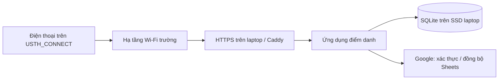

# Laptop và sinh viên cùng Wi‑Fi USTH

Phương án người dùng chọn: ứng dụng và SQLite chạy trên laptop cá nhân; laptop và sinh viên cùng kết nối `USTH_CONNECT`. Sinh viên truy cập **trực tiếp trong mạng nội bộ**. Không cần thuê VPS hoặc dùng tunnel Internet cho phương án này.



## Điều kiện để chạy được

1. **Thiết bị sinh viên truy cập được laptop.** Cùng SSID chưa chứng minh có cùng subnet hoặc được phép liên lạc. Nếu mạng bật client isolation hoặc chia VLAN không có route phù hợp, cần IT cho phép truy cập tới laptop. Tài liệu Wi‑Fi đã cung cấp chưa nói về cấu hình này.
2. **IP laptop ổn định trong buổi.** Nhờ IT đặt DHCP reservation hoặc cấp địa chỉ đúng quy trình; không tự chọn một IP tĩnh có thể trùng máy khác. Không dùng IP Docker/VPN làm địa chỉ cho điện thoại.
3. **Tên miền và HTTPS hợp lệ trên điện thoại.** DNS mà sinh viên dùng phải trỏ hostname tới IP nội bộ của laptop. Cần chứng chỉ đúng hostname được trình duyệt tin cậy và khai báo hostname HTTPS trong Authorized JavaScript origins của Google. [Google Identity](https://developers.google.com/identity/gsi/web/guides/get-google-api-clientid).
4. **Chỉ các phân đoạn mạng được phép tới trang điểm danh.** IT xác nhận CIDR nguồn thực tế của CONNECT; Guest/VPN không được nằm trong phạm vi chấp nhận. App kiểm tra CIDR ở server, không đọc SSID.

Không yêu cầu 700 sinh viên cài chứng chỉ tự ký hoặc sửa file hosts. Để Google login hoạt động bình thường, ưu tiên IT cấp hostname và chứng chỉ được điện thoại tin cậy. Laptop không nhận kết nối công khai từ Internet thì không mặc định dùng được ACME HTTP/TLS challenge; có thể dùng chứng chỉ IT cấp hoặc DNS challenge cho domain có quyền quản lý. [Caddy HTTPS](https://caddyserver.com/docs/automatic-https).

Google login và đồng bộ Sheets vẫn cần Internet. Sau khi đã đăng nhập và trang đã tải đủ, các lượt gửi trong LAN được lưu ở laptop khi Sheets không truy cập được; không cam kết mọi tình huống mất Internet vẫn đăng nhập hoặc tải trang mới được.

## Thử kết nối từ điện thoại trước

Trên laptop đã vào USTH_CONNECT:

```bash
ip -brief -4 address
npm run lan:probe -- --host IP_WIFI_CUA_LAPTOP
```

Thay `IP_WIFI_CUA_LAPTOP` bằng IPv4 của card Wi‑Fi. Không dùng địa chỉ Docker/VPN. Ví dụ dưới đây dùng IP giả để minh họa; **không phải IP/subnet USTH**, cần thay bằng địa chỉ thật trên laptop:

```bash
npm run lan:probe -- --host 10.20.30.40
```

Lệnh in ra URL dạng `http://IP:4188/probe/...`. Trên điện thoại, kết nối cùng USTH_CONNECT, tắt dữ liệu di động khi thử, mở đúng URL được in. Nếu thấy “Đã kết nối được tới laptop” thì đường HTTP từ điện thoại đó tới laptop hoạt động. Trang thử không ghi danh tính/điểm danh, không phục vụ file; tự đóng sau 5 phút hoặc Ctrl+C.

Nếu không vào được: kiểm tra lại IP, firewall laptop, mạng của điện thoại và nhờ IT kiểm tra client isolation/VLAN. Nếu cần, cho phép riêng cổng thử từ CIDR đã xác nhận trong thời gian thử; không tắt toàn bộ firewall. Probe thành công chưa chứng minh HTTPS, Google hoặc toàn bộ access point đều hoạt động; thử vài điện thoại ở các vị trí trong phòng trước khi tăng tải.

## Cấu hình ứng dụng và HTTPS

Giữ Node chỉ nghe localhost; Caddy nhận HTTPS trên card mạng trường:

```dotenv
BIND_HOST=127.0.0.1
PORT=4180
PUBLIC_ORIGIN=https://TEN_MIEN_DA_CAP
TRUSTED_PROXY_CIDRS=127.0.0.1/32,::1/128
BP_DATABASE=./data/web-live.sqlite
```

`CAMPUS_CIDRS` phải là **các dải nguồn nội bộ mà laptop thực sự thấy và IT xác nhận**, không lấy dải IP public của phương án VPS. Không thêm `127.0.0.1` hoặc toàn bộ dải private để hết lỗi. Nếu mạng có router/NAT giữa các VLAN, cần kiểm tra nguồn laptop thấy có phân biệt được Guest/VPN không. Thêm OAuth, domain Google, roster, admin, QR secret, Sheet và credentials theo [WEB-SETUP.vi.md](WEB-SETUP.vi.md).

Mẫu riêng: [Caddyfile.lan](../deploy/Caddyfile.lan). Điền các biến trong môi trường dịch vụ Caddy, hoặc thay placeholder bằng giá trị thật:

| Biến của Caddy | Nội dung |
| --- | --- |
| ATTENDANCE_HOST | Hostname thật, không kèm `https://` |
| LAPTOP_LAN_IP | IP laptop đã được giữ ổn định |
| ATTENDANCE_CERT_FILE | Đường dẫn full certificate chain đúng hostname |
| ATTENDANCE_KEY_FILE | Đường dẫn private key, chỉ dịch vụ Caddy/quản trị đọc được |

Biến trong `.env` của Node không tự đi vào Caddy. Caddy chỉ tin IP socket rồi ghi đè header chuyển tới Node. Mẫu không dành cho Cloudflare, CDN hoặc một proxy khác đứng phía trước.

Cài Caddy theo hướng dẫn của hệ điều hành, kiểm tra `caddy validate --config deploy/Caddyfile.lan --adapter caddyfile` với biến và chứng chỉ thật, rồi chạy bằng service có quyền bind cổng 443. Firewall chỉ mở 443 từ mạng sinh viên được phép; Node 4180 giữ localhost. Mẫu hiện chưa được chạy với chứng chỉ/tên miền USTH thật.

TA cũng dùng hostname HTTPS này. Truy cập thử `/readyz` từ điện thoại trước, rồi thử đăng nhập/điểm danh. `localhost` trên điện thoại là chính điện thoại, không phải laptop.

## Giữ laptop chạy trong buổi học

Trên Linux/systemd, dùng mẫu service theo **user hiện tại**, có đúng đường dẫn Node (kể cả khi cài bằng nvm), thay vì mặc định Node ở `/usr/bin/node` như máy chủ cài riêng.

```bash
npm run laptop:prepare
cat data/systemd/bp-attendance-laptop.service
```

Lệnh chỉ tạo file service để xem xét trong `data/systemd/`; không cài dịch vụ, không đổi nguồn/sleep và không mở cổng. Sau khi hoàn tất `.env`, Google, mạng và HTTPS, cài/chạy bằng tài khoản laptop:

```bash
systemctl --user link "$PWD/data/systemd/bp-attendance-laptop.service"
systemctl --user daemon-reload
systemctl --user start bp-attendance-laptop.service
systemctl --user status bp-attendance-laptop.service
systemd-inhibit --list
```

Service yêu cầu chặn sleep/idle/lid switch trong lúc chạy và tự khởi động lại khi tiến trình lỗi. Nếu hệ điều hành từ chối quyền inhibitor, service có thể không chạy: xem log, xử lý chính sách nguồn của laptop trước khi phục vụ lớp. Inhibitor không bảo đảm chống tắt máy cưỡng bức, hết pin hoặc mọi cấu hình desktop. Cắm sạc, để nắp mở, giữ phiên đăng nhập hệ điều hành và kiểm tra thực tế máy không ngủ. Không bật auto-update/restart hoặc chạy tác vụ nặng trong buổi điểm danh.

Service user chưa được bật tự chạy lúc login; chủ động bật trước buổi. Không chạy thêm `npm start` cùng database. Nếu đổi thư mục repo hoặc phiên bản Node/nvm, tạo lại file, daemon-reload và thử trước buổi; không đổi trong lúc sinh viên gửi.

Sau buổi, chờ đồng bộ hoặc xác nhận dữ liệu đang chờ đã lưu, backup rồi tắt:

```bash
python3 scripts/backup-db.py data/web-live.sqlite data/backups
systemctl --user stop bp-attendance-laptop.service
```

Backup này nằm cùng laptop; chép sang nơi riêng được trường cho phép để bảo vệ khi hỏng/mất máy. [Hướng dẫn backup/restore](USTH-HOSTING.vi.md#backup-và-phục-hồi).

## Sức tải và tính hợp lệ

Phép đo trên laptop hiện tại từng nhận đủ 700 lượt gửi dồn khoảng 2 giây; có một đợt 300 lượt mất 7,88 giây. Đây là HTTP loopback, chưa đo việc Wi‑Fi cùng phục vụ 700 điện thoại và laptop host. [Báo cáo đầy đủ](LOAD-TEST.vi.md).

Nhờ sinh viên đăng nhập sớm; mở phiên 5–8 phút, QR đổi 30 giây liên tục. Trước khi dùng chính thức, thử tải qua HTTPS và hạ tầng Wi‑Fi thật, ghi nhận cả lỗi lẫn độ trễ bất thường. Nếu thiết bị không thể tới laptop hoặc laptop ngừng chạy, TA đối chiếu thẻ và ghi ngoại lệ; không lấy HTTP probe làm điểm danh.

Cùng Wi‑Fi vẫn không chứng minh đúng người hoặc đúng phòng. Giữ Google–MSSV, CIDR, QR có hạn và quy trình đối chiếu thẻ do giảng viên chốt. Các giới hạn chi tiết ở [ANTI-PROXY.vi.md](ANTI-PROXY.vi.md).
