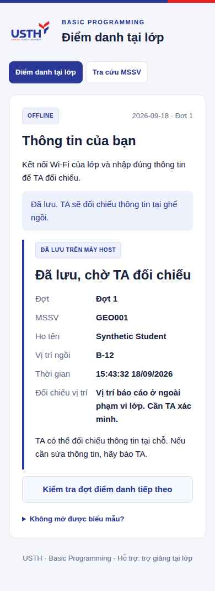
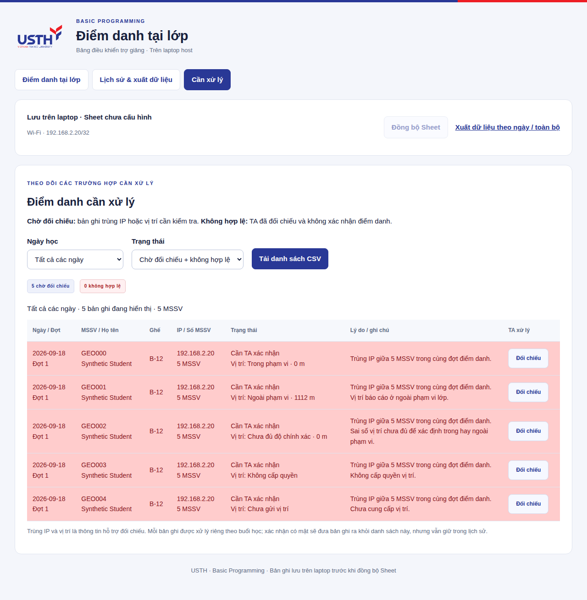

# Đối chiếu vị trí khi điểm danh

App vẫn chạy trên laptop, cùng mạng với sinh viên. TA có thể bật kiểm tra vị trí cho từng đợt mới. Sinh viên bấm **Lấy vị trí**, cho phép trong tab HTTPS, quay lại biểu mẫu rồi gửi. Laptop tính khoảng cách tới tâm lớp do TA đặt.

**Đây là thông tin hỗ trợ TA đối chiếu.** Ngoài phạm vi được tô đỏ và đưa vào **Cần xử lý**, chưa được tự kết luận có mặt hoặc gian lận. Không lấy được vị trí, từ chối quyền và sai số lớn có lý do riêng. TA kiểm tra tại ghế rồi xác nhận hoặc không xác nhận. QR động, hạn quét, kiểm tra mạng và trùng IP vẫn áp dụng.

## Chuẩn bị trang HTTPS một lần

Trình duyệt yêu cầu [secure context và quyền của người dùng để lấy vị trí](https://developer.mozilla.org/en-US/docs/Web/API/Geolocation/getCurrentPosition). Trang IP LAN HTTP không đáp ứng điều này. Repo có một trang hỗ trợ tĩnh trong `site/location/`; chỉ trang này cần HTTPS, không chuyển máy chủ điểm danh ra Internet.

Trang HTTPS đã xuất bản ngày 18/09/2026: `https://namle24.github.io/bp-attendance/location/`.

Người quản lý repo bật **Settings → Pages → Source: GitHub Actions**, rồi chạy thủ công workflow **Publish location helper**. Workflow chỉ xuất bản thư mục `site`, không chứa database, cấu hình, danh sách lớp hoặc API điểm danh. Push code không tự xuất bản trang này. Cần xác minh URL HTTPS tải được trước khi bật đối chiếu vị trí cho lớp. Fork repo phải sửa `HELPER_URL` trong `web/location.cjs` thành địa chỉ của trang hỗ trợ thuộc repo đó.

GitHub Pages cung cấp HTTPS và hỗ trợ repo công khai trên gói miễn phí: [tài liệu GitHub](https://docs.github.com/en/pages/getting-started-with-github-pages/what-is-github-pages). Không cần mua tên miền hay cài chứng chỉ cho sinh viên. Điện thoại cần Internet để tải trang hỗ trợ; ứng dụng quét QR có thể chặn tab mới, khi đó mở biểu mẫu bằng Safari/Chrome.

## TA sử dụng

1. Dừng app cũ, cập nhật code và chạy `npm start` như bình thường.
2. Trên bảng TA, mở **Kiểm tra vị trí lớp** khi chưa có đợt đang nhận.
3. Bật **Đối chiếu vị trí**, bấm **Lấy vị trí laptop** rồi kiểm tra tọa độ và sai số. Laptop thường không có GPS; nếu kết quả không đủ chính xác, nhập tọa độ lớp đã kiểm tra trên bản đồ. Không lấy IP hay cường độ Wi-Fi làm khoảng cách.
4. Đặt bán kính, mặc định **100 m**, có thể chọn **20–2.000 m**. Nhập đúng sai số của tâm; chỉ dùng 0 khi tọa độ lớp đã được xác nhận. Sai số tâm không được vượt quá nửa bán kính.
5. Bấm **Lưu vị trí cho hôm nay**, rồi mở đợt QR mới.
6. Theo dõi màn **Cần xử lý**. Đối chiếu thực tế, ghi lý do và lưu quyết định TA.

Mỗi ngày cần xác nhận lại tâm lớp. Đợt mới chụp lại thiết lập hiện tại; mở lại một đợt giữ nguyên tâm và bán kính của đợt đó. Các đợt cũ chưa bật vị trí tiếp tục giữ kết quả cũ. Muốn áp dụng vị trí sau khi đã bắt đầu điểm danh, đóng đợt, lưu thiết lập rồi **mở đợt mới**.

## Sinh viên sử dụng

1. Quét QR đang chiếu, nhập MSSV, họ tên và ghế như trước.
2. Bấm **Lấy vị trí**. Trong tab mới, bấm **Cho phép lấy vị trí** và đồng ý với yêu cầu của trình duyệt.
3. Khi tab trả kết quả, quay lại biểu mẫu và gửi trong **60 giây**. Nếu để lâu, lấy lại vị trí trước khi gửi.
4. Nếu không lấy được vị trí, có thể gửi để TA kiểm tra tại ghế. Biên nhận ghi rõ **chờ TA đối chiếu**, không tự ghi là hợp lệ.



## Cách đánh dấu

Máy chủ tính khoảng cách `d` từ hai tọa độ và tổng sai số `u = sai số tâm + sai số thiết bị`, với bán kính `R`:

| Điều kiện | Kết quả |
| --- | --- |
| `u ≤ R` và `d + u ≤ R` | Trong phạm vi theo thông tin thiết bị |
| `u ≤ R` và `d − u > R` | Ngoài phạm vi, tô đỏ để TA đối chiếu |
| Vùng sai số giao biên, hoặc `u > R` | Chưa đủ độ chính xác, cần TA đối chiếu |
| Thiếu vị trí, từ chối quyền, lỗi hoặc quá hạn | Ghi lý do tương ứng, cần TA đối chiếu |

Trong phạm vi vẫn có thể bị đánh dấu vì trùng IP. Kết quả vị trí đã lưu không thay đổi khi gửi lại cùng một lượt hoặc TA đổi thiết lập cho đợt sau. Khoảng cách và sai số hiển thị được làm tròn; phân loại dùng giá trị trước khi làm tròn.



Ảnh minh họa dùng dữ liệu kiểm thử riêng. Các lượt trong ảnh dùng chung một IP nên cả dòng “Trong phạm vi” cũng bị đánh dấu trùng IP.

## Dữ liệu và giới hạn

- Chỉ lấy một vị trí sau khi sinh viên bấm nút, không theo dõi liên tục.
- Trang HTTPS không có API nhận dữ liệu hay mã theo dõi. Nó chuyển kết quả về đúng cửa sổ điểm danh bằng [postMessage](https://developer.mozilla.org/en-US/docs/Web/API/Window/postMessage), kiểm tra origin, cửa sổ nguồn và mã ngẫu nhiên của yêu cầu. Fragment không chứa MSSV hoặc tọa độ; tọa độ không được gửi tới máy chủ GitHub Pages.
- Trình duyệt có thể giữ tạm tọa độ cùng lượt gửi đang chờ để phục hồi khi mất kết nối; xóa tọa độ khỏi lượt chờ sau khi nhận biên nhận. Laptop nhận tọa độ để tính toán nhưng SQLite, CSV và Sheets chỉ lưu trạng thái, khoảng cách, sai số và bán kính. Tọa độ tâm lớp được lưu theo đợt và trong lịch sử thiết lập TA.
- Đường truyền từ trang điểm danh tới laptop vẫn là HTTP LAN, chưa mã hóa. Trang hỗ trợ HTTPS không biến kết nối LAN thành HTTPS.
- Sai số thiết bị là ước lượng, không phải bảo đảm vị trí thật. Định vị ngang không xác nhận đúng tầng hoặc đúng phòng cạnh nhau. Vị trí do trình duyệt gửi có thể bị giả lập; [Chrome có chức năng giả lập tọa độ](https://developer.chrome.com/docs/devtools/sensors). Không sử dụng kết quả này như bằng chứng duy nhất về gian lận.
- Nếu Wi-Fi chặn thiết bị kết nối với nhau, tính năng vị trí không khắc phục được đường mạng; vẫn cần mạng cho phép truy cập laptop.

CSV chi tiết có thêm trạng thái vị trí, khoảng cách, sai số, bán kính và lý do. Các dòng cần xác minh vẫn được đồng bộ đỏ khi bật chức năng ghi Sheets. Tab kết quả **Offline** do TA sửa và trang tra cứu MSSV không tự thay đổi quyết định của TA.

## Kiểm thử

```bash
npm test
npm run check
BP_BENCH_COUNTS=700 BP_BENCH_ROUNDS=2 BP_BENCH_LOCATION=1 npm run bench:web
BP_PLAYWRIGHT_MODULE=/path/to/playwright BP_CHROMIUM=/path/to/chromium node scripts/test-location-ui.cjs
# Kiểm tra trang HTTPS đã xuất bản, không chặn/đáp ứng bằng nội dung local:
BP_LOCATION_LIVE_HELPER=1 BP_PLAYWRIGHT_MODULE=/path/to/playwright BP_CHROMIUM=/path/to/chromium node scripts/test-location-ui.cjs
```

Mặc định, kiểm thử trình duyệt dùng trang HTTP trên địa chỉ LAN riêng và nội dung trang hỗ trợ được chặn/đáp ứng tại URL HTTPS trong Chromium. Chế độ `BP_LOCATION_LIVE_HELPER=1` tải trực tiếp từ GitHub Pages. Cả hai xác minh HTTP parent là insecure context, popup HTTPS là secure context, quyền vị trí, trả kết quả và TA xác nhận. Tọa độ là dữ liệu giả lập.

Ngày 18/09/2026, chế độ trang HTTPS thật đã chạy thành công cho các trường hợp trong phạm vi, ngoài phạm vi, sai số lớn, từ chối quyền và thiếu vị trí. Giao diện QR, gửi lại khi mất mạng, mở lại đợt, xuất CSV và tra cứu cũng vượt qua kiểm tra lại. Cần thử quyền và vị trí thật trên iPhone/Android trước khi bật cho lớp; kết quả Chromium với tọa độ giả lập chưa xác nhận được bước này.
