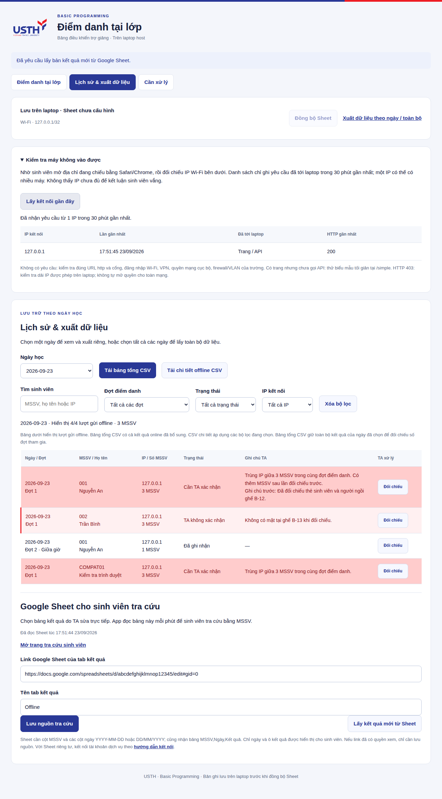

# Truy cập điện thoại · bản 0.9.1

Sinh viên quét QR, nhập **MSSV và họ tên**. Không thu hàng ghế, không xin vị trí, không mở tab HTTPS. Mở lại đợt và tạo đợt mới trong ngày vẫn dùng như trước.

## Khi máy tải lâu hoặc trắng

Giao diện, CSS, hình ảnh và mã gửi điểm danh được gửi cùng một phản hồi nén. Không còn chuỗi tải script bắt buộc, không có font/CDN bên ngoài. Yêu cầu xác nhận QR hoặc đọc phiên tự thử lại một lần khi lỗi kết nối, với thời hạn hữu hạn; mã quá hạn vẫn bị từ chối.

Bấm **Mở biểu mẫu tối giản nếu trang tải lâu** ở đầu trang, hoặc thêm `/simple` vào địa chỉ sinh viên đang chiếu. Điền MSSV, họ tên, rồi nhập mã hiện tại và gửi. Biểu mẫu này không cần JavaScript, vẫn kiểm tra QR, mạng, cookie, một MSSV và một trình duyệt mỗi đợt. Nếu không mở được cả địa chỉ cơ bản thì biểu mẫu tối giản cũng chưa thể tới máy host.

Mở trực tiếp bằng Safari/Chrome thay vì cửa sổ bên trong ứng dụng quét QR. Cookie của trang cần được cho phép; không cần localStorage/sessionStorage. Gửi xong mở lại trang sẽ nhận biên nhận của trình duyệt hiện tại. Nếu phản hồi bị mất, giữ trang rồi gửi lại; không thêm bản ghi.

## TA xác định lỗi kết nối

1. Cho sinh viên mở đúng `http://IP_LAPTOP:4180/readyz` bằng trình duyệt, giữ đúng IP đang chiếu. Cổng có thể khác nếu TA cấu hình lại.
2. Lấy **IP Wi-Fi hiện tại của điện thoại**, vào **Kiểm tra máy không vào được → Lấy kết nối gần đây** trên trang TA.
3. Không có IP đó: chưa thấy yêu cầu HTTP tới laptop từ IP được báo. Kiểm tra đăng nhập Wi-Fi/captive portal, đúng HTTP/cổng, VPN, quyền mạng cục bộ nếu ứng dụng có hỏi, firewall hoặc client isolation/VLAN. NAT có thể khiến laptop thấy IP khác; phối hợp IT khi cần. Không nới dải mạng ra toàn Internet hoặc tắt firewall.
4. Có trang, chưa có API: thử biểu mẫu tối giản; có thể do JavaScript hoặc trình duyệt nhúng. Đây chỉ là dấu hiệu, không xác định chắc lỗi trình duyệt.
5. HTTP 403: app đã nhận nhưng từ chối yêu cầu. Đối chiếu dải mạng, địa chỉ host và thông báo trên máy sinh viên. IP khác dải phải được IT xác nhận trước khi thêm vào `CAMPUS_CIDRS`.

Danh sách chỉ giữ tối đa 1.000 IP trong RAM, hiển thị 30 phút gần nhất, xóa khi tắt app. Không ghi URL đầy đủ, mã QR, MSSV, cookie hay họ tên. Chỉ trang TA trên localhost xem được. Không thấy kết nối không phải căn cứ kết luận vắng.

## Chống gửi hộ và giới hạn

- Một MSSV chỉ có một bản ghi mỗi đợt, kể cả dùng nhiều thiết bị.
- Một cookie trình duyệt chỉ gắn một lượt gửi mỗi đợt; quét QR khác hoặc mở tab mới vẫn bị khóa. Khóa và lượt gửi được lưu cùng giao dịch SQLite, tồn tại sau khởi động lại host.
- Vé quét gắn IP, trình duyệt, đợt, thế hệ mở lại và thời hạn. Sao chép vé sang trình duyệt khác không gửi được.
- Mở lại đợt giữ khóa. Đợt mới cho phép mỗi trình duyệt gửi thêm một lần. Không tự khóa cả ngày vì lớp có nhiều đợt.
- Nhiều MSSV cùng IP bị đánh dấu đỏ để TA đối chiếu. Không chặn cứng toàn IP vì NAT có thể gom nhiều máy thật.

Cookie **không xác định được thiết bị vật lý hay con người**. Xóa cookie, ẩn danh, trình duyệt khác, IP host thay đổi hoặc máy thứ hai có thể tạo nhận diện khác. USTH_CONNECT/guest không cung cấp danh tính cho app. Với MSSV tự khai, không thể tự chặn một người nhập MSSV khác trên laptop sau khi gửi bằng điện thoại. Cần xác thực tài khoản/email gắn MSSV, hoặc TA kiểm tra thẻ rồi phát mã cá nhân dùng một lần; kiểm tra ngẫu nhiên tại lớp vẫn cần thiết.

## Trùng MSSV cần xuống bàn TA

Gửi lại đúng lượt từ cùng trình duyệt chỉ trả biên nhận cũ. Nếu cùng MSSV có một lượt quét/gửi hợp lệ từ trình duyệt khác trong đợt, hệ thống giữ bản ghi đầu và chuyển sang **Thiếu đối chiếu — trùng MSSV**. Cả hai trình duyệt xem được yêu cầu bổ sung email trường và mang thẻ sinh viên xuống bàn TA. Nhập email không tự xác nhận có mặt. Xem [quy trình và ảnh](DUPLICATE-REVIEW.vi.md).

Trang đang mở tự đọc lại biên nhận sau khoảng 25–35 giây, giãn ngẫu nhiên để tránh cả lớp hỏi cùng lúc; tạm ngừng khi tab bị ẩn và kiểm tra khi quay lại. Biểu mẫu không JavaScript có nút tải lại kết quả. Không cần quét lại để bổ sung email cho hồ sơ đã lưu, kể cả khi đợt đã đóng.

## Nâng cấp và dữ liệu cũ

Dừng app bằng Ctrl+C, trong thư mục đã clone chạy `git pull --ff-only`, rồi `npm start`. Giữ `data` và `.env`. Tải lại trang/QR mới sau khi nâng cấp; vé quét cũ chưa ràng buộc cookie cần quét lại.

Cột hàng ghế và bằng chứng vị trí cũ được giữ trong SQLite/CSV/Sheet chi tiết để không làm mất lịch sử; lượt mới không thu các dữ liệu này. Chính sách vị trí đã lưu không còn cản việc mở đợt mới hoặc yêu cầu sinh viên lấy vị trí. Dữ liệu và quyết định TA trước đây được giữ nguyên. Với bản ghi cũ chưa có nhận diện trình duyệt, gửi cùng MSSV vẫn bị chặn nhưng không suy đoán là một thiết bị khác để tạo hồ sơ vi phạm.

Tài liệu tham khảo: [MDN: thứ tự thực thi script defer](https://developer.mozilla.org/en-US/docs/Web/HTML/Reference/Elements/script), [MDN: Origin của POST form và Referrer-Policy](https://developer.mozilla.org/en-US/docs/Web/HTTP/Reference/Headers/Origin), [Apple: quyền mạng cục bộ của ứng dụng](https://support.apple.com/en-sg/102229). Các cơ chế trình duyệt này không xác nhận nguyên nhân trên một điện thoại chưa được quan sát.
