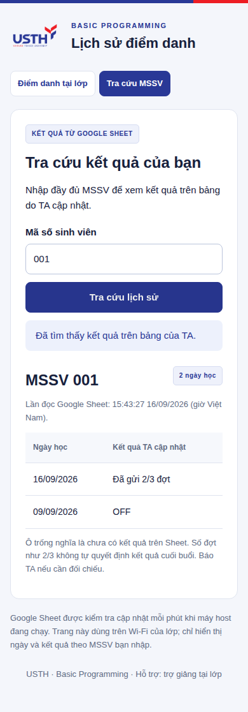

# Sinh viên tra cứu kết quả từ Google Sheet

TA sửa bảng kết quả trên Google Sheet. App đọc lại bảng mỗi phút khi laptop host đang chạy, lưu một bản kết quả tại máy và cho sinh viên tra cứu **đúng một MSSV**. Kết quả này độc lập với biên nhận vừa gửi: một lượt gửi thành công chưa có nghĩa TA đã cập nhật Sheet.

## Thiết lập một lần trên máy host

1. Trong Google Sheet, chọn đúng tab TA sửa kết quả, ví dụ **Offline**. Sao chép **toàn bộ link trên thanh địa chỉ**, giữ phần `gid=…` để chọn đúng tab.
2. Trên bảng TA của app, mở **Lịch sử & xuất dữ liệu → Google Sheet cho sinh viên tra cứu**.
3. Dán link, điền đúng tên tab, bấm **Lưu nguồn tra cứu**.
4. Chờ thông báo **Đã đọc Sheet lúc…**. Mở liên kết **Mở trang tra cứu sinh viên**, nhập một MSSV và đối chiếu kết quả với Sheet.

Nếu link đã có quyền xem, app đọc được ngay. App giữ nguyên quyền chia sẻ của file. Bảng riêng tư có thể dùng tài khoản dịch vụ với quyền **Viewer**: lưu khóa riêng tại đường dẫn `GOOGLE_APPLICATION_CREDENTIALS` của máy host, bật Sheets API và chia sẻ quyền xem file cho email của tài khoản dịch vụ. Xem phần chuẩn bị tài khoản trong [cấu hình Sheets](WEB-SETUP.vi.md); chức năng tra cứu chỉ cần quyền đọc, không cần bật `GOOGLE_SHEET_ID` để ghi.

Nguồn tra cứu được lưu trong database của máy host; khi chuyển sang laptop khác, thiết lập lại nguồn trên laptop đó. Không đưa khóa tài khoản dịch vụ hoặc database vào GitHub.

## Cấu trúc bảng

Dòng đầu cần có **MSSV** và các cột ngày ở dạng `YYYY-MM-DD` hoặc `DD/MM/YYYY`. Các cột họ tên/email được bỏ qua khi tạo dữ liệu tra cứu.

| MSSV | Họ tên | Email trường | 2026-09-09 | 2026-09-16 |
| --- | --- | --- | --- | --- |
| 001 | Nguyễn An | | OFF | Đã gửi 2/3 đợt |
| AB002 | Trần Bình | | | TA đã xác nhận |

Bảng dạng ba cột **MSSV, Ngày, Kết quả**, mỗi dòng là một MSSV/ngày, cũng được hỗ trợ. MSSV cần được giữ dưới dạng văn bản trên Sheet để không mất số 0 đầu. Không lặp MSSV trong bảng ngang hoặc lặp cặp MSSV/ngày trong bảng dọc.

Ứng dụng hiển thị nguyên văn ô kết quả, không tự chuyển `2/3` thành có mặt/vắng. Ô trống ghi **Chưa có kết quả**. Không tìm thấy MSSV cũng không được hiểu là vắng. Giới hạn một tab: 5.000 dòng dữ liệu, 400 cột, mỗi ô kết quả tối đa 200 ký tự trên một dòng; dữ liệu vượt giới hạn/bị lỗi không thay thế bản đã đọc thành công.

Đọc CSV của tab giữ nguyên MSSV có chữ, số và số 0 đầu theo giá trị hiển thị. Không dùng truy vấn tự suy luận kiểu cột vì có thể làm trống MSSV khi cột có nhiều kiểu dữ liệu.

## Sinh viên sử dụng

1. Kết nối Wi-Fi của lớp khi laptop host đang chạy.
2. Mở trang điểm danh → **Tra cứu MSSV**; hoặc mở địa chỉ sinh viên được TA cung cấp và thêm `/history`.
3. Nhập đầy đủ MSSV → **Tra cứu lịch sử**.
4. Kiểm tra ngày học, kết quả và **Lần đọc Google Sheet**. Sau khi TA sửa bảng, chờ khoảng một phút rồi tra cứu lại; TA cũng có thể bấm **Lấy kết quả mới từ Sheet**.

Màn tra cứu chỉ có MSSV vừa nhập, ngày và kết quả. Không hiển thị họ tên, email, ghế, IP hay ghi chú nội bộ của hệ thống điểm danh. MSSV là khóa tra cứu, không phải mật khẩu xác thực người xem.

Ảnh chụp dùng dữ liệu kiểm thử riêng; không chứa dữ liệu sinh viên của lớp.

Đây là trang trên laptop host trong mạng lớp. Khi laptop tắt hoặc sinh viên ở ngoài mạng truy cập được máy host, trang sẽ không mở; tính năng này không tạo website Internet độc lập.

## Mất kết nối và dữ liệu cũ

App phục vụ tra cứu từ bản kết quả đã lưu, không gọi Google riêng cho từng sinh viên. Nếu đọc Sheet thất bại, kết quả cũ được giữ cùng thời gian đọc và cảnh báo rõ trên trang. Nếu chưa từng đọc thành công, trang báo chưa có dữ liệu để tra cứu. Đổi nguồn Sheet sẽ bỏ bản tra cứu của nguồn cũ để tránh hiển thị nhầm lớp.

Lượt gửi điểm danh vẫn được ghi vào SQLite độc lập với việc đọc Google Sheet. Đọc kết quả không mở/đóng đợt, không sửa biên nhận và không ghi ngược vào Sheet. Các tab **BP_Web_Attendance** và **BP_Offline_Check** do chức năng đồng bộ tự ghi; TA nên sửa một tab kết quả riêng như **Offline** để tránh bị đồng bộ ghi đè.
