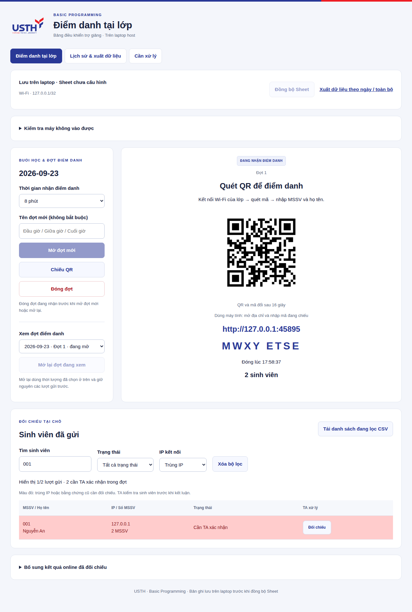

# Điểm danh thông thường và bộ lọc TA

Sinh viên quét QR hoặc nhập mã đang chiếu, điền **MSSV và họ tên** rồi gửi. Mặc định không xin quyền vị trí và không mở trang HTTPS. Không cần GPS để dùng luồng thông thường.

Từ 0.9.0 app không thu vị trí hoặc hàng ghế. Nếu tải chậm, có biểu mẫu tối giản và công cụ kiểm tra kết nối trên trang TA. Xem [truy cập điện thoại](MOBILE-ACCESS.vi.md).

## Lọc và xuất danh sách

Cả ba màn **Điểm danh tại lớp**, **Lịch sử & xuất dữ liệu**, **Cần xử lý** có:

- Tìm MSSV và họ tên hoặc IP. Tìm tên có hoặc không có dấu đều được; nhiều từ khóa phải cùng khớp một bản ghi.
- Trạng thái ghi nhận hoặc quyết định TA. Màn Cần xử lý chỉ gồm đang chờ và TA không xác nhận.
- IP trùng / không trùng trong cùng đợt.
- Ngày/đợt: chọn đợt trên màn điểm danh; chọn ngày và đợt trong lịch sử hoặc danh sách cần xử lý.

Bấm **Xóa bộ lọc** để bỏ tìm kiếm và các tiêu chí trong màn đang xem; ngày đang chọn được giữ nguyên. App giữ bộ lọc trong lúc tự cập nhật danh sách.

**CSV danh sách đang lọc**, **CSV chi tiết offline** và **CSV cần xử lý** áp dụng đúng các tiêu chí đang chọn. **Bảng tổng CSV** giữ toàn bộ kết quả của ngày đã chọn, gồm online đã bổ sung, để TA xem đủ số đợt đã tham gia.

Ảnh dùng dữ liệu kiểm thử. Lọc riêng một sinh viên vẫn hiển thị số MSSV dùng chung IP của cả đợt.

## Cơ chế chống gửi trùng

- Một trình duyệt chỉ gửi một MSSV mỗi đợt; khóa nằm trong database và gắn với cookie có chữ ký, không phụ thuộc sessionStorage. Xóa cookie/ẩn danh/đổi trình duyệt/thiết bị có thể tạo nhận diện mới.

- Một MSSV chỉ có một bản ghi trong một đợt, kể cả đổi trình duyệt, mở tab mới hoặc quét lại QR.
- Gửi lại sau mất phản hồi lấy lại biên nhận đã lưu; không tạo thêm dòng.
- Mở lại đợt giữ nguyên quy tắc chống trùng. Mở đợt mới trong cùng buổi cho phép gửi thêm một lượt vào đợt mới.
- Nhiều MSSV dùng chung IP trong cùng đợt được đánh dấu đỏ để TA xác minh. Bộ lọc không làm thay đổi nhóm IP hay quyết định của TA. Trùng IP không tự chứng minh gian lận vì nhiều người có thể dùng chung đường mạng.

## Phạm vi tương thích

Xem [kết quả kiểm thử](WEB-VALIDATION.md). Kiểm thử engine không thay cho việc thử trên điện thoại thật và mạng trường.
