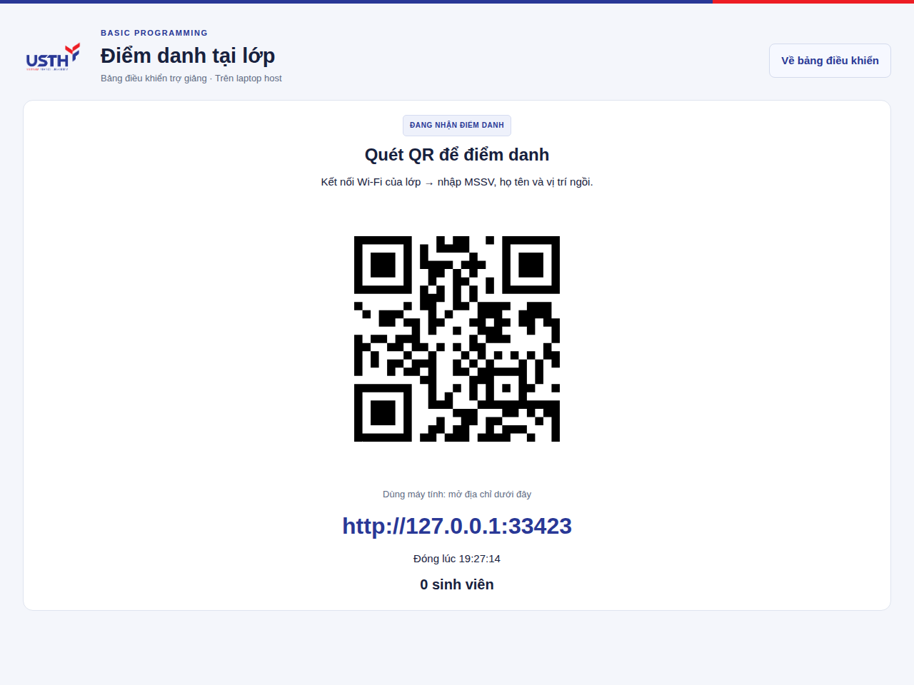
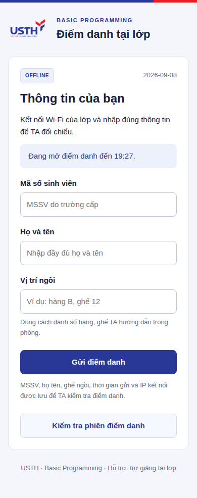
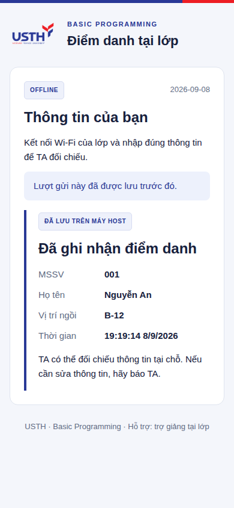
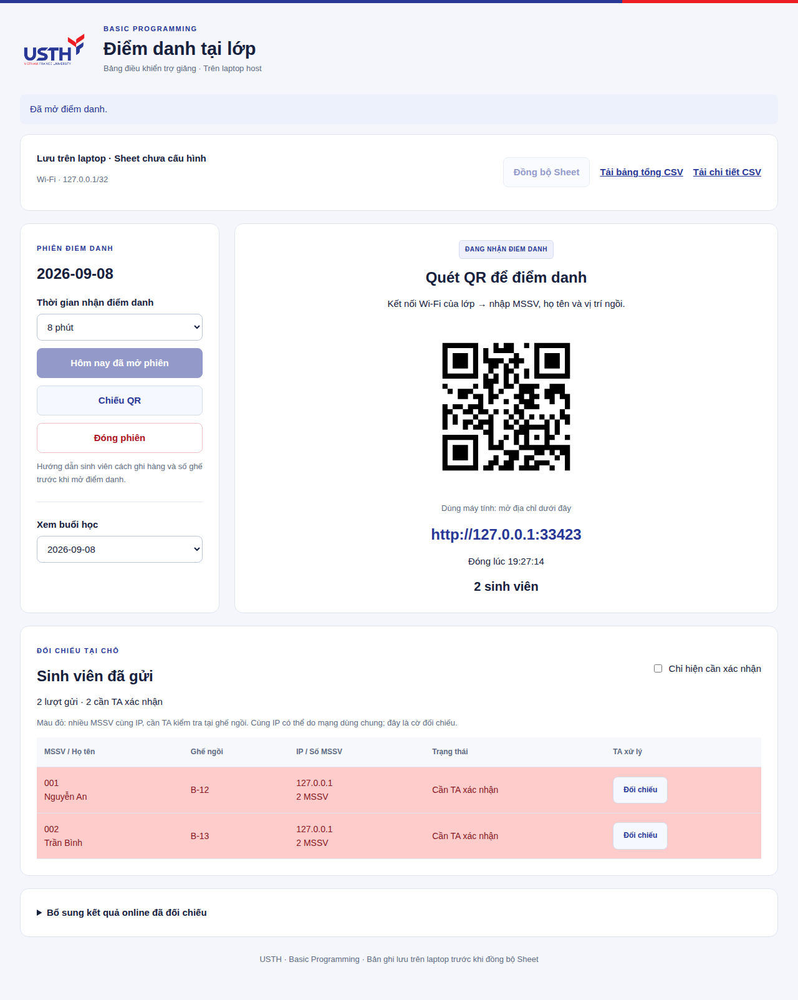
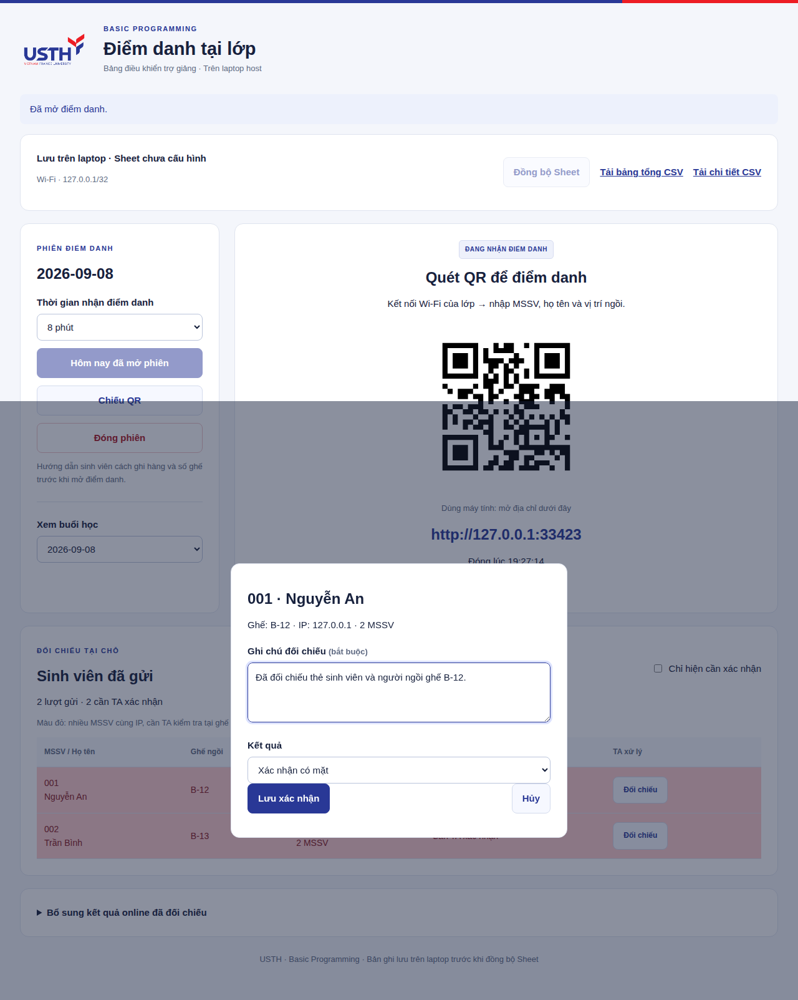

# Hướng dẫn TA · Điểm danh offline

## 1. Mở phiên trên laptop host

Người host bật dịch vụ. Trên chính laptop đó, mở **http://127.0.0.1:4181**. Trang TA không mở từ điện thoại/laptop khác qua Wi-Fi.

Kiểm tra đúng ngày, thống nhất cách ghi ghế (ví dụ hàng B, ghế 12), chọn thời gian rồi bấm **Mở QR điểm danh**. Mặc định 8 phút. App chuyển sang màn chiếu, có QR và URL cho sinh viên dùng máy tính.

QR chứa đường dẫn vào biểu mẫu, không đổi mỗi 30 giây. Phiên nhận điểm danh có thời hạn và do TA mở. Nếu máy host đổi IP, QR/link sẽ đổi khi khởi động lại app.

## 2. Sinh viên gửi thông tin

1. Kết nối cùng Wi-Fi của lớp với laptop host, hoàn tất đăng nhập USTH_CONNECT nếu mạng yêu cầu.
2. Quét QR bằng điện thoại hoặc gõ URL hiển thị trên máy tính. Gõ cả `http://` và `:4180`.
3. Nhập **MSSV**, **họ tên đầy đủ**, **vị trí ngồi**.
4. Bấm **Gửi điểm danh**, chờ **Đã ghi nhận điểm danh**.

Nếu báo chưa xác nhận được kết quả, giữ trang và bấm gửi lại. Lượt gửi được nhận diện bằng khóa ngẫu nhiên của trang, nên không thêm bản ghi trùng khi phản hồi mạng bị mất. Nếu MSSV đã được người khác/thiết bị khác gửi trước, app yêu cầu báo TA. Không lấy MSSV làm mật khẩu để xem biên nhận của người khác.

Sai họ tên/ghế/MSSV sau khi đã gửi: báo TA để đối chiếu và ghi chú; sinh viên không tự ghi đè lượt đã lưu. TA không coi biên nhận này là bằng chứng chắc chắn về danh tính.

## 3. Đối chiếu các dòng đỏ

Bấm **Về bảng điều khiển**. Bảng tự cập nhật mỗi 10 giây. Bật **Chỉ hiện cần xác nhận** nếu muốn lọc.

- Cờ trùng IP tính trong **cùng phiên**, theo số **MSSV khác nhau**. Tất cả thành viên nhóm đều được đánh dấu, gồm người gửi đầu tiên.
- Bấm gửi lại, reload hoặc mở buổi học tuần sau không tự tạo lỗi trùng IP cho một MSSV.
- Nếu nhiều người cùng bị đỏ, kiểm tra trước xem mạng có gom thiết bị qua NAT/proxy. Không mặc định kết luận điểm danh hộ.
- TA đến vị trí khai báo, đối chiếu người và thẻ/MSSV theo quy trình giảng viên thống nhất.

Bấm **Đối chiếu** trên dòng cần xử lý → nhập ghi chú → chọn **Xác nhận có mặt** hoặc **Không xác nhận** → **Lưu xác nhận**.

Ghi chú bắt buộc. Kết quả được lưu trên laptop và đồng bộ sang Sheet; xác nhận xong thì bỏ nền đỏ. Nếu sau đó có thêm MSSV cùng IP, các bản ghi từng được xác nhận sẽ cần kiểm tra lại; nếu nhóm đổi trong lúc đang mở hộp xác nhận, app yêu cầu tải lại danh sách. Không tự lặp lại việc xác nhận khi chưa nhìn thấy nhóm mới.

Dùng app để lưu xác nhận, không chỉnh trực tiếp trạng thái/màu trong tab do app đồng bộ. Danh sách chi tiết có ghi chú và thời gian; lịch sử các lần xác nhận lưu trong database và API TA `/api/audit`.

## 4. Kết thúc buổi học

Phiên tự hết hạn hoặc TA bấm **Đóng phiên**. Mỗi ngày chỉ mở một phiên, vì vậy kiểm tra thời gian trước khi mở/đóng. Không xóa database để mở lại phiên.

Xem trạng thái đồng bộ. Nếu Sheet chưa cấu hình/lỗi mạng, bản ghi vẫn ở laptop; tải **bảng tổng CSV** và **chi tiết CSV**. CSV không giữ màu, nhưng vẫn có trạng thái và số MSSV cùng IP. Muốn Excel có màu, xuất `.xlsx` từ Google Sheets sau khi đồng bộ.

Người host backup rồi dừng app theo [hướng dẫn host](HOST-QUICKSTART.vi.md). Các TA khác có thể xem Sheet theo quyền của lớp; thao tác quản lý app trên laptop host.
