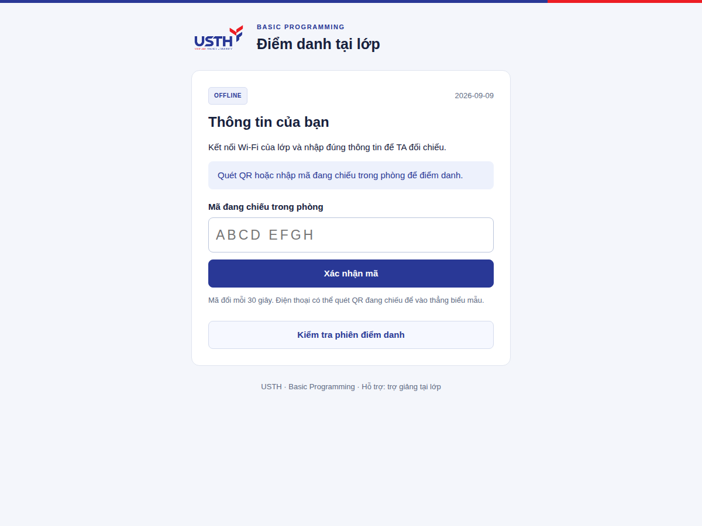
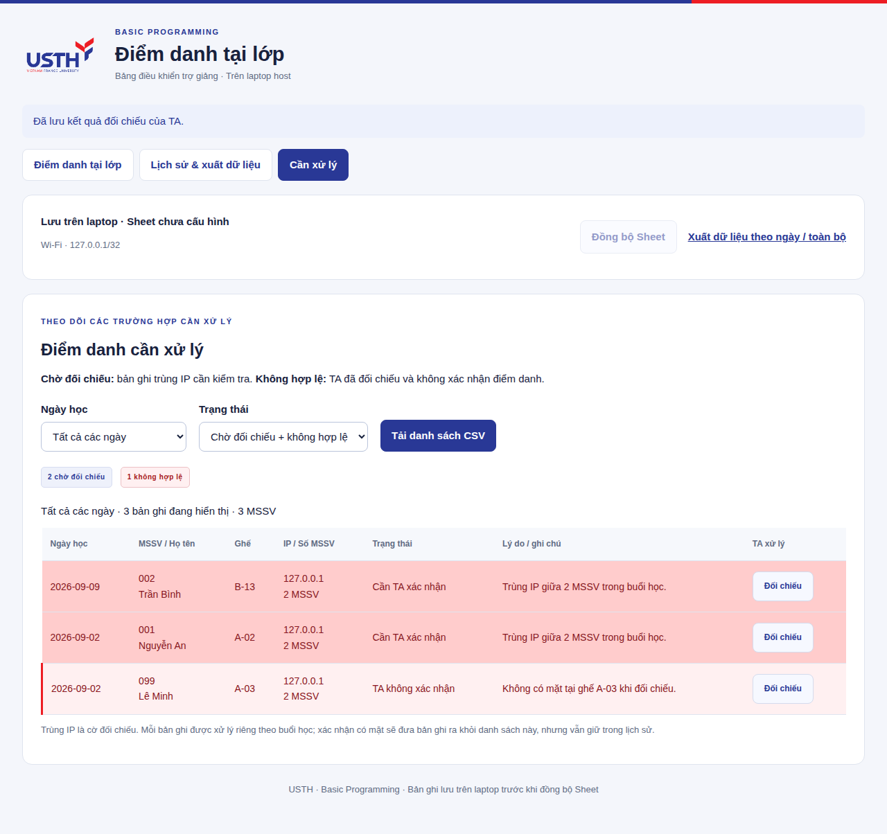
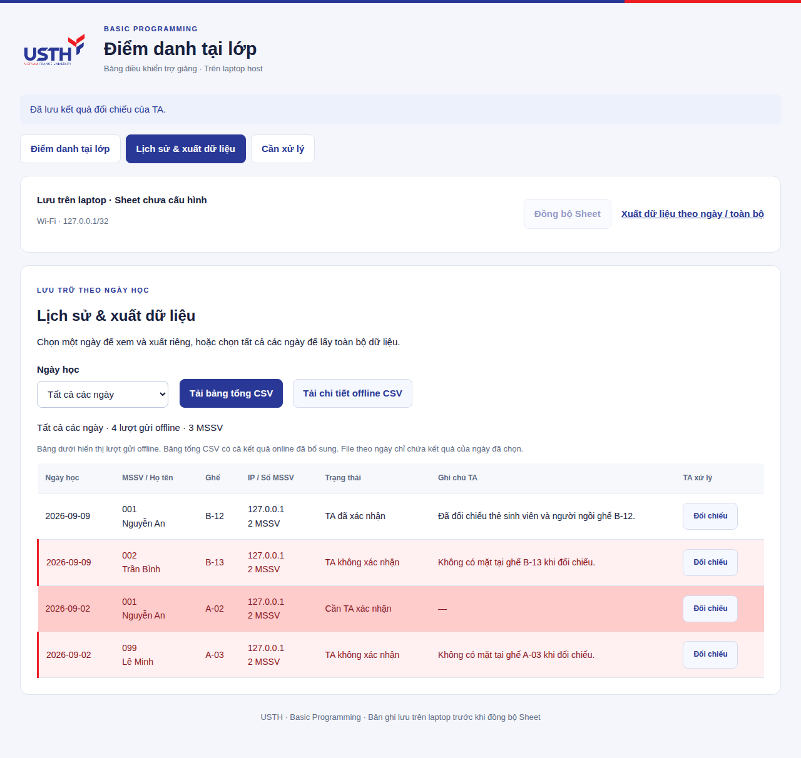

# Hướng dẫn TA · Điểm danh offline

## 1. Mở phiên trên laptop host

Người host chạy `npm start` trên Windows, macOS hoặc Linux. App tự chuẩn bị dữ liệu và mở trình duyệt. Nếu hiện trang chọn mạng, bấm Wi-Fi đang dùng trong phòng. Trang TA tại **http://127.0.0.1:4181** chỉ mở trên laptop host. Giữ cửa sổ chạy app mở trong giờ học.

Kiểm tra đúng ngày, thống nhất cách ghi ghế (ví dụ hàng B, ghế 12), chọn thời gian rồi bấm **Mở QR điểm danh**. Mặc định 8 phút. App chuyển sang màn chiếu, có QR và URL cho sinh viên dùng máy tính.

**QR và mã 8 ký tự đổi mỗi 30 giây**, có đồng hồ đếm ngược. Mã cũ hết hiệu lực ngay khi đổi. Chỉ màn TA trên laptop lấy được mã hiện tại; trang sinh viên không tự lấy mã mới. Giữ màn chiếu mở trong thời gian điểm danh. Nếu máy host đổi IP, dừng app bằng Ctrl+C rồi chạy lại và chiếu QR mới.

## 2. Sinh viên gửi thông tin

1. Kết nối cùng Wi-Fi của lớp với laptop host, hoàn tất đăng nhập USTH_CONNECT nếu mạng yêu cầu.
2. Quét QR đang chiếu bằng điện thoại. Với máy tính: mở URL hiển thị (gồm `http://` và `:4180`), nhập mã 8 ký tự đang chiếu. Mã không đúng/đã đổi thì nhập mã hiện tại.
3. Nhập **MSSV**, **họ tên đầy đủ**, **vị trí ngồi** trong thời gian còn lại (tối đa 3 phút từ lúc xác nhận mã, không quá giờ đóng phiên). Giữ nguyên Wi-Fi.
4. Bấm **Gửi điểm danh**, chờ **Đã ghi nhận điểm danh**.

Nếu hết thời gian nhập hoặc đổi IP trước khi gửi, quét/nhập mã mới. Mỗi lượt xác nhận mã chỉ gửi được cho một MSSV. QR động hạn chế dùng lại mã cũ, không tự xác minh danh tính hoặc ngăn được chuyển tiếp mã còn hạn.

Nếu báo chưa xác nhận được kết quả, giữ trang và bấm gửi lại. Lượt gửi được nhận diện bằng khóa ngẫu nhiên của trang, nên không thêm bản ghi trùng khi phản hồi mạng bị mất. Nếu MSSV đã được người khác/thiết bị khác gửi trước, app yêu cầu báo TA. Không lấy MSSV làm mật khẩu để xem biên nhận của người khác.

Sai họ tên/ghế/MSSV sau khi đã gửi: báo TA để đối chiếu và ghi chú; sinh viên không tự ghi đè lượt đã lưu. TA không coi biên nhận này là bằng chứng chắc chắn về danh tính.

## 3. Đối chiếu các dòng đỏ

Bấm **Về bảng điều khiển**. Bảng tự cập nhật mỗi 10 giây. Bật **Chỉ hiện cần xác nhận** nếu muốn lọc.

- Cờ trùng IP tính trong **cùng phiên**, theo số **MSSV khác nhau**. Tất cả thành viên nhóm đều được đánh dấu, gồm người gửi đầu tiên.
- Bấm gửi lại, reload hoặc mở buổi học tuần sau không tự tạo lỗi trùng IP cho một MSSV.
- Nếu nhiều người cùng bị đỏ, kiểm tra trước xem mạng có gom thiết bị qua NAT/proxy. Không mặc định kết luận điểm danh hộ.
- TA đến vị trí khai báo, đối chiếu người và thẻ/MSSV theo quy trình giảng viên thống nhất.

Bấm **Đối chiếu** trên dòng cần xử lý → nhập ghi chú → chọn **Xác nhận có mặt** hoặc **Không xác nhận** → **Lưu xác nhận**.

Ghi chú bắt buộc. Kết quả được lưu trên laptop và đồng bộ sang Sheet; xác nhận xong thì bỏ nền đỏ. Nếu sau đó có thêm MSSV cùng IP, các bản ghi từng được xác nhận sẽ cần kiểm tra lại; nếu nhóm đổi trong lúc đang mở hộp xác nhận, app yêu cầu tải lại danh sách. Không tự lặp lại việc xác nhận khi chưa nhìn thấy nhóm mới.

Dùng app để lưu xác nhận, không chỉnh trực tiếp trạng thái/màu trong tab do app đồng bộ. Danh sách chi tiết có ghi chú và thời gian; lịch sử các lần xác nhận lưu trong database và API TA `/api/audit`.

## 4. Màn riêng cho các trường hợp cần xử lý

Chọn **Cần xử lý** trên thanh điều hướng. Mặc định hiển thị các buổi đã lưu và hai nhóm:

- **Chờ TA đối chiếu:** trùng IP, chưa kết luận điểm danh không hợp lệ.
- **TA xác nhận không hợp lệ:** TA đã đối chiếu và chọn không xác nhận, có ghi chú lý do.

Chọn **Ngày học** để xem riêng một buổi hoặc **Tất cả các ngày**. Chọn **Trạng thái** để lọc một nhóm hoặc cả hai. Mỗi dòng là một lượt điểm danh của một MSSV trong một buổi; một sinh viên có thể xuất hiện ở nhiều ngày. Bộ đếm hiển thị cả số bản ghi và số MSSV khác nhau.

Bấm **Đối chiếu** để xử lý ngay tại đây. Xác nhận có mặt sẽ đưa lượt đó ra khỏi danh sách cần xử lý, nhưng không xóa khỏi lịch sử. Nếu đổi lại quyết định sau đối chiếu, ghi chú mới và lịch sử xử lý được lưu như bình thường.

**Tải danh sách CSV** xuất đúng ngày và trạng thái đang chọn, gồm ghế, IP, số MSSV cùng IP, lý do, ghi chú và thời gian. Ví dụ `BP_Review_2026-09-09_rejected.csv` chỉ gồm lượt TA không xác nhận trong ngày 09/09/2026. CSV không lưu màu; đọc cột trạng thái/lý do để xử lý.

## 5. Tra cứu và xuất từng ngày hoặc toàn bộ

Chọn **Lịch sử & xuất dữ liệu**. Dữ liệu được lưu theo ngày học trong cùng database, không cần đổi hoặc tạo lại database sau mỗi buổi.

1. Chọn ngày đã học trong **Ngày học**, hoặc **Tất cả các ngày**.
2. Kiểm tra bảng bên dưới: ngày, MSSV/họ tên, ghế, IP, trạng thái và ghi chú TA.
3. Chọn **Tải bảng tổng CSV** hoặc **Tải chi tiết offline CSV**.

| Báo cáo | Theo một ngày | Toàn bộ |
| --- | --- | --- |
| Bảng tổng | MSSV có kết quả ngày đó, một cột ngày; gồm kết quả online đã nhập nếu có | Tất cả sinh viên và cột ngày học đã lưu |
| Chi tiết offline | Các lượt gửi LAN trong ngày, gồm ghế/IP/trạng thái/ghi chú/giờ gửi | Toàn bộ lượt gửi LAN, mỗi bản ghi có cột ngày |

Ví dụ: `BP_Attendance_2026-09-09.csv`, `BP_Offline_Check_2026-09-09.csv`; xuất toàn bộ có `_all.csv` trong tên. Ngày đã mở nhưng chưa có bản ghi sẽ xuất file chỉ có tiêu đề. Xuất file không đánh vắng các sinh viên chưa gửi.

CSV là dữ liệu tại thời điểm tải. TA đối chiếu bổ sung sau đó thì tải lại để lấy kết quả mới. Các bộ lọc chỉ ảnh hưởng màn đang xem/file tải, không thu hẹp dữ liệu đồng bộ Sheet hoặc xóa các ngày khác. Hai màn này chỉ truy cập trên laptop host, không công khai danh sách sinh viên qua trang điểm danh.

## 6. Kết thúc buổi học

Phiên tự hết hạn hoặc TA bấm **Đóng phiên**. Mỗi ngày chỉ mở một phiên, vì vậy kiểm tra thời gian trước khi mở/đóng. Không xóa database để mở lại phiên.

Xem trạng thái đồng bộ. Nếu Sheet chưa cấu hình/lỗi mạng, bản ghi vẫn ở laptop; vào **Lịch sử & xuất dữ liệu** để tải bảng tổng và chi tiết theo phạm vi cần dùng. CSV không giữ màu, nhưng vẫn có trạng thái và số MSSV cùng IP. Muốn Excel có màu, xuất `.xlsx` từ Google Sheets sau khi đồng bộ.

Người host backup rồi dừng app theo [hướng dẫn host](HOST-QUICKSTART.vi.md). Các TA khác có thể xem Sheet theo quyền của lớp; thao tác quản lý app trên laptop host.
