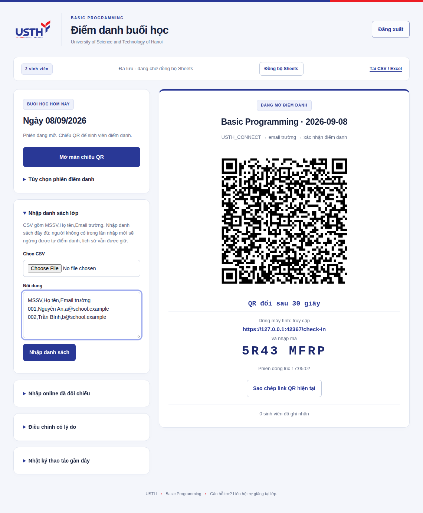
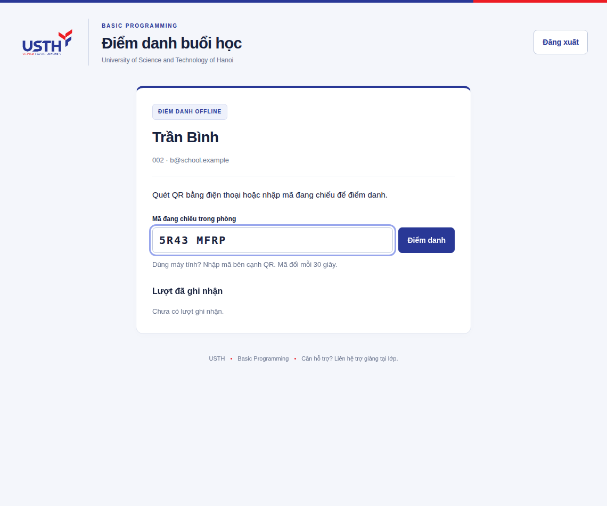

# Hướng dẫn trợ giảng · BP Attendance

Tài liệu dành cho TA vận hành buổi học. Nếu bạn là người mở server trên laptop, làm [HOST-QUICKSTART.vi.md](HOST-QUICKSTART.vi.md) trước.

## 1. Vào đúng website của lớp

Kết nối `USTH_CONNECT`, hoàn tất đăng nhập Wi‑Fi. Mở URL HTTPS do người host cung cấp, đăng nhập email trường. Người host cần thêm email bạn vào `ADMIN_EMAILS` trước khi khởi động app.

Thấy màn TA thì đã có quyền quản trị. Nếu chỉ thấy màn sinh viên, báo người host kiểm tra email quản trị. TA khác dùng chung website của laptop host; không mở thêm một server/database riêng cho cùng buổi.

## 2. Chuẩn bị danh sách lớp

Thường làm trước buổi đầu; chỉ nhập lại khi roster thay đổi. Mở **Nhập danh sách lớp**, chọn file CSV hoặc dán nội dung, rồi bấm **Nhập danh sách**.

File CSV cần đúng ba cột **MSSV,Họ tên,Email trường**, mỗi sinh viên một dòng. Tải [mẫu tiêu đề CSV](../examples/roster.csv) rồi điền danh sách chính thức. Giữ MSSV có số 0 đầu; dùng đúng email chính được trường xác nhận.

**Nhập cả danh sách đầy đủ**, không chỉ dán vài sinh viên bổ sung: người bị bỏ khỏi lần nhập mới sẽ ngừng được tự điểm danh. Lịch sử của họ vẫn được giữ. App báo lỗi nếu MSSV/email không hợp lệ hoặc xung đột liên kết; không tự đổi email đã gắn Google chỉ để vượt lỗi.

## 3. Mở buổi và chiếu QR

1. Trên màn TA, bấm **Mở QR điểm danh**. App mở phiên hôm nay trong **8 phút** và chuyển thẳng sang màn chiếu.
2. Nếu cần thời gian khác, chọn trước trong **Tùy chọn phiên điểm danh**. Nếu phiên đang mở, nút **Mở màn chiếu QR** đưa bạn trở lại màn chiếu, không tạo phiên mới.
3. Nhắc sinh viên: điện thoại quét QR rồi xác nhận; máy tính mở URL dưới QR rồi nhập mã 8 ký tự.

QR và mã nhập thay cùng nhau mỗi **30 giây**; phiên vẫn tiếp tục tới giờ đóng. Chỉ chiếu QR/mã trong phòng, tránh đưa vào luồng học online. Nếu mã hết hạn khi sinh viên còn đăng nhập, cho quét lại mã mới. Không cần tạo phiên mới khi QR thay đổi.

## 4. Sinh viên thấy gì?

**Trên điện thoại:** sau khi đăng nhập và quét mã, trang hiện tên/MSSV/email của chính tài khoản đó. Sinh viên bấm **Xác nhận điểm danh** rồi chờ kết quả.

| Trước khi xác nhận | Đã ghi nhận |
| --- | --- |
|  |  |

**Trên máy tính:** mở địa chỉ HTTPS dưới QR, đăng nhập Google trường. Nhập đúng mã 8 ký tự đang chiếu (không phân biệt hoa/thường, có thể thêm khoảng trắng), bấm **Điểm danh** rồi chờ xác nhận. Không cần camera. Mã cũ hết hạn thì nhập mã mới; quá 10 lần gửi mã/phút/tài khoản cần chờ hoặc dùng QR trên điện thoại.

“Đã ghi nhận” hoặc “Bạn đã được ghi nhận trước đó” đều có nghĩa server đã tìm thấy bản ghi. Gửi lại không nhân đôi. Khi mất kết nối, sinh viên kiểm tra lịch sử hoặc quét lại mã mới; không tự coi thông báo đang chờ/lỗi là điểm danh thành công.

Số lượng trên màn TA cập nhật định kỳ, có thể chậm vài giây. Google Sheets đồng bộ sau khi app lưu; trạng thái Sheets đang lỗi không xóa những receipt đã cấp.

## 5. Đóng phiên, xử lý online và sửa ngoại lệ

Hết giờ, server tự chặn lượt mới. Nếu kết thúc sớm, thoát trình chiếu → mở **Tùy chọn phiên điểm danh** → bấm **Đóng phiên**. **Mỗi ngày chỉ một phiên offline, không mở lại phiên đã đóng.** Nếu bấm đóng nhầm hoặc sinh viên lỗi máy, TA đối chiếu rồi dùng **Điều chỉnh có lý do** theo quyết định của giảng viên.

- **Nhập online đã đối chiếu:** chọn ngày đã học, nhập MSSV mỗi dòng, ghi nguồn/tiêu chí đã kiểm tra rồi xác nhận. Chưa tự lấy dữ liệu Zoom/Meet.
- **Điều chỉnh có lý do:** chọn ngày đã có phiên, MSSV, kết quả và lý do cụ thể. App giữ người sửa, thời gian và lịch sử điều chỉnh.
- **Nhật ký thao tác gần đây:** tải để đối chiếu thao tác nhập/mở/đóng/sửa. Không công khai nhật ký chứa dữ liệu lớp.

`OFF` = offline; `ON` = online; `BOTH` cần đối chiếu; `V`/`EXCUSED` là kết quả TA xác nhận; **ô trống chưa là vắng**. Không chỉnh tay tab tổng hợp vì lần đồng bộ sau app sẽ dựng lại bảng.

## 6. Kết thúc buổi

1. Kiểm tra số lượt và các trường hợp cần đối chiếu. Cùng Wi‑Fi/QR không thay thế kiểm tra đúng người nếu giảng viên yêu cầu.
2. Xem trạng thái Sheets; có thể bấm **Đồng bộ Sheets**. Nếu lỗi, người host kiểm tra cấu hình/quyền và giữ database để đồng bộ lại.
3. **Tải CSV / Excel** trong app tải file CSV. Muốn `.xlsx`, xuất từ Google Sheets; khi nhập CSV vào Excel, giữ MSSV ở kiểu Text.
4. Nhờ người host backup và dừng dịch vụ sau khi hoàn tất. Buổi sau mở phiên đúng ngày; app tạo thêm cột ngày mới.

## Khi có lỗi

| Hiện tượng | Cách xử lý |
| --- | --- |
| Điện thoại không mở được website | Báo người host kiểm tra app/Caddy, IP, Wi‑Fi, sleep và HTTPS; đây có thể là lỗi đường mạng |
| Yêu cầu kết nối mạng USTH | Kiểm tra CONNECT/4G/VPN; nhiều người cùng lỗi thì nhờ IT kiểm tra CIDR, không bỏ cổng mạng |
| Tài khoản chưa có trong lớp | Đối chiếu email Google với roster, báo TA quản lý danh sách |
| QR/mã nhập hết hạn | Quét QR mới hoặc nhập mã đang chiếu; phiên đăng nhập vẫn giữ |
| Phiên đã đóng | TA xác minh ngoại lệ theo tiêu chí giảng viên; dùng điều chỉnh có lý do sau khi xác minh |
| Chưa xác nhận được kết quả | Kiểm tra lịch sử; khi mạng ổn định quét lại/gửi lại, dữ liệu đã lưu không bị nhân đôi |
| Sheets đang lỗi | Giữ laptop/database, báo người host; receipt đã cấp vẫn có thể đã lưu đầy đủ |

Khi lỗi hạ tầng cả phòng, TA đối chiếu thẻ và ghi ngoại lệ có lý do theo quy trình môn. Không kết luận sinh viên vắng chỉ vì không vào được website.
