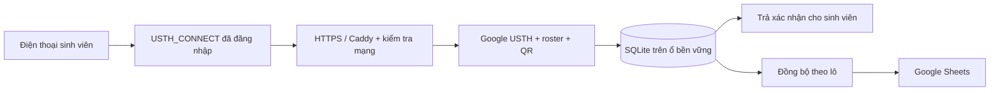

# Điểm danh offline USTH: căn cứ xác nhận và triển khai ổn định

**Lựa chọn mới nhất của người dùng: laptop cá nhân và sinh viên cùng USTH_CONNECT.** Làm theo [LAPTOP-LAN.vi.md](LAPTOP-LAN.vi.md) cho đường truy cập và dịch vụ laptop. Phần VM/VPS dưới đây giữ làm tham khảo; chưa triển khai phương án đó.

## Những gì tài liệu Wi‑Fi xác nhận

Đã đọc văn bản và ảnh trong `USTH Wi-Fi Login Guide.docx` do người dùng cung cấp ngày 08/09/2026. Không đưa bản tài liệu hoặc ảnh nội bộ đó vào repo.

- `USTH_CONNECT` dành cho cán bộ, giảng viên và sinh viên; người dùng kết nối rồi đăng nhập qua cổng `login.usth.edu.vn` bằng tài khoản email USTH.
- `USTH_Guest` có luồng khách và không yêu cầu tài khoản USTH.
- Văn bản có ví dụ `username@usth.edu.vn`; ảnh màn hình có ví dụ `student@st.usth.edu.vn`. Đây không phải danh sách đầy đủ domain Google Workspace. Cần IT xác nhận `hd` và email chính trong roster.
- Tài liệu không nêu CIDR, VLAN, địa chỉ ra Internet, việc chia sẻ đường ra giữa các mạng, VPN, số thiết bị tối đa hoặc API cung cấp danh tính từ cổng Wi‑Fi.

Vì vậy **đăng nhập Wi‑Fi không tự đăng nhập ứng dụng điểm danh**. Website hiện tại xác minh Google riêng và không nhận mật khẩu email. Cần giữ hai bước này cho tới khi IT cung cấp tích hợp SSO được xác thực; không sao chép trang nhập mật khẩu của Wi‑Fi vào ứng dụng.

## Căn cứ của một lượt điểm danh

Ở đây “hợp lệ” được hiểu là đáp ứng quy trình điểm danh được giảng viên chấp nhận, có căn cứ để đối chiếu. Tài liệu Wi‑Fi không phải quyết định phê duyệt quy trình điểm danh.

| Điều kiện | Bản web hiện tại kiểm tra | Giới hạn cần biết |
| --- | --- | --- |
| Tài khoản thuộc sinh viên trong lớp | Google ID token hợp lệ, domain `hd`, email, liên kết Google `sub` với MSSV | Không xác minh người đang cầm máy là chủ tài khoản |
| Đi qua mạng được phép | IP nguồn qua chuỗi proxy tin cậy, đối chiếu CIDR | Không đọc SSID; IP Internet dùng chung có thể không phân biệt CONNECT, Guest hoặc VPN |
| Có mã của phiên đang mở | QR có chữ ký, đổi 30 giây, server kiểm tra thời gian và trạng thái | Mã vẫn có thể được chuyển tiếp tức thời tới một người cùng mạng được phép |
| Không tự đổi MSSV/ghi trùng | MSSV lấy từ roster; một bản ghi cho mỗi sinh viên/phiên | Không ngăn một người có quyền đăng nhập nhiều tài khoản khác nhau |
| Có căn cứ sửa kết quả | Bản ghi giờ, IP, tài khoản; TA điều chỉnh có người sửa và lý do | Quản trị cơ sở dữ liệu vẫn có thể sửa dữ liệu; đây không phải nhật ký bất biến |

**Không nên tuyên bố “chống điểm danh hộ 100%”.** Giảng viên cần chốt trước ý nghĩa của `OFF`, thời gian điểm danh, kiểm tra thẻ chọn mẫu và cách xử lý ngoại lệ. Nếu yêu cầu xác minh đúng người cho tất cả sinh viên thì cần bước đối chiếu trực tiếp; mẫu kiểm tra không tự chứng minh cả lớp.

Nếu cần xác nhận **tài khoản đăng nhập Wi‑Fi trùng tài khoản điểm danh**, hoặc thiết bị gắn với access point của đúng phòng, IT phải cung cấp cơ chế đối chiếu phiên mạng đáng tin cậy. App chưa có tích hợp này. IP public chung không đủ để suy ra quan hệ đó.

## Nên đặt website ở đâu

Ưu tiên máy chủ/VM do IT USTH quản lý, có tên miền HTTPS và ổ đĩa bền vững. Nhờ IT chỉ cho phân đoạn mạng `USTH_CONNECT` được truy cập, loại mạng khách và đường VPN ngoài trường theo yêu cầu môn. Website nội bộ vẫn cần DNS/HTTPS hoạt động trên điện thoại và đường tới Google cho đăng nhập, đồng bộ.

VPS riêng cũng dùng được: sinh viên vào URL HTTPS như một website thông thường. IT cung cấp đủ CIDR IPv4/IPv6 ra Internet của CONNECT. Nếu Guest/VPN dùng chung đường ra, phải tách đường ra hoặc bổ sung cơ chế mạng; cấu hình một danh sách IP trên VPS không giải quyết được sự nhập nhằng này.



Mức máy **đề xuất để bắt đầu thử nghiệm**: 2 vCPU, RAM 2 GiB, SSD khoảng 20 GiB, Linux với Node.js 24 và Python 3. Đây chưa phải cấu hình đã benchmark hoặc bảo đảm cho mọi nhà cung cấp. Chạy lại phép đo trên chính máy sẽ triển khai, rồi thử qua mạng trường. Nếu IT cấp máy khác, dùng kết quả đo của máy đó để quyết định.

Bản này chạy một process Node và một SQLite local. Chọn môi trường chạy liên tục, không tự ngủ, không xóa filesystem khi cập nhật. Không triển khai bản hiện tại lên hosting chỉ phục vụ file tĩnh hoặc bật nhiều replica với SQLite riêng. Một máy chủ là một điểm có thể gây gián đoạn; cấu hình tự khởi động lại không thay thế cụm dự phòng khi cả máy hoặc ổ đĩa hỏng.

## Các biện pháp đã có trong code

- Điểm danh được commit vào SQLite trước khi báo thành công. Gửi lại không nhân đôi; Sheets chậm/lỗi không làm mất receipt đã lưu.
- Tra tài khoản bằng chỉ mục, không đọc cả roster cho từng yêu cầu. Giới hạn bộ nhớ cho bảng đếm request; nhiều sinh viên cùng NAT vẫn có quota theo phiên hợp lệ.
- Các đăng nhập Google tới cùng lúc dùng chung lần lấy khóa công khai nếu cache chưa sẵn sàng. Thư viện Google vẫn kiểm tra chữ ký, issuer, audience, expiry; không kéo dài hạn cache. Tải khóa có giới hạn chờ 8 giây, không retry ngầm nhiều lần.
- Trình duyệt hết chờ sau khoảng 20 giây và báo cách xử lý. Không tự gửi lại hàng loạt. Khi phản hồi điểm danh bị mất, app đọc lịch sử riêng của sinh viên để xác nhận lại; không tự báo có mặt nếu không có bản ghi.
- Các lần hỏi cập nhật QR/dashboard không chồng lên nhau khi mạng chậm. QR hết hạn bị ẩn, không tiếp tục dùng vì lỗi mạng.
- Có giới hạn chờ ở Node và proxy, endpoint `/readyz` kiểm tra đọc database, mẫu service tự khởi động lại khi process lỗi, công cụ backup SQLite đang hoạt động.

`/healthz` kiểm tra tiến trình HTTP; `/readyz` thêm khả năng đọc database. Cả hai không tiết lộ dữ liệu lớp. HTTP 200 chưa chứng minh còn dung lượng ghi đĩa, Google đang hoạt động hoặc Wi‑Fi đủ tải. Cần giám sát thêm dung lượng ổ đĩa, lỗi 5xx và trạng thái đồng bộ trong màn TA.

## Cài dịch vụ trên Linux có systemd

Thực hiện trên máy chủ đã được chọn, với tài khoản quản trị hệ thống. Repo hiện tại **chưa được đưa lên máy chủ hoặc cấp URL thật**. Không chạy các lệnh cài service lên laptop chỉ để xem demo.

1. IT tạo user hệ thống `bp-attendance`, đặt bản code đã duyệt ở `/opt/bp-attendance`, cài dependencies bằng `npm ci --omit=dev`. Code chỉ cho quản trị sửa; app chỉ ghi `/var/lib/bp-attendance`.
2. Cài Node.js 24+ system-wide; mẫu service dùng `/usr/bin/node`. Nếu khác, sửa `ExecStart` thành đường dẫn thật, không dùng Node nằm trong thư mục home bị service chặn. Backup dùng `/usr/bin/python3`.
3. Tạo `/etc/bp-attendance/app.env` từ `.env.example`; điền OAuth, domain, CIDR, admin, QR secret, Sheet và credentials. Đặt `BP_DATABASE=/var/lib/bp-attendance/attendance.sqlite`, `BIND_HOST=127.0.0.1`, `PORT=4180`. File cấu hình chỉ root đọc; credentials Google cho group `bp-attendance` đọc, không cho người khác đọc. Lưu QR secret ổn định qua restart.
4. Cài [service web](../deploy/bp-attendance.service), [service backup](../deploy/bp-attendance-backup.service) và [timer backup](../deploy/bp-attendance-backup.timer) vào `/etc/systemd/system/`. Kiểm tra rồi bật:

```bash
sudo systemd-analyze verify /etc/systemd/system/bp-attendance.service /etc/systemd/system/bp-attendance-backup.service /etc/systemd/system/bp-attendance-backup.timer
sudo systemctl daemon-reload
sudo systemctl enable --now bp-attendance.service bp-attendance-backup.timer
sudo systemctl status bp-attendance.service
curl --fail http://127.0.0.1:4180/readyz
```

Service tạo thư mục dữ liệu quyền 0700, khởi động lại sau 3 giây khi process lỗi; nếu lỗi khởi động lặp 10 lần trong 120 giây thì dừng để quản trị sửa cấu hình. Backup mặc định 03:15 theo giờ máy chủ; đặt timezone theo chính sách vận hành.

5. Cài Caddy, dùng [Caddyfile mẫu](../deploy/Caddyfile); đặt biến `ATTENDANCE_HOST` trong môi trường của **dịch vụ Caddy**, hoặc thay placeholder bằng hostname thật. Chạy `caddy validate` với cấu hình và môi trường đó trước khi reload. Mở HTTPS tới Caddy; không mở cổng Node 4180 cho sinh viên. Mẫu chỉ dành cho một proxy; khi thêm CDN cần kiểm tra lại IP nguồn.
6. Cấu hình giám sát từ ngoài process: kiểm tra HTTPS `/readyz` định kỳ và báo cho người vận hành khi lỗi liên tiếp; theo dõi dung lượng đĩa. Chưa có dịch vụ giám sát/cảnh báo bên ngoài được kết nối trong repo. Không tự restart máy chỉ vì Google Sheets đang lỗi.

## Backup và phục hồi

Timer tạo snapshot local đã kiểm tra cấu trúc dữ liệu, không chép thẳng file SQLite đang có WAL. Có thể chạy thêm sau mỗi buổi:

```bash
sudo systemctl start bp-attendance-backup.service
sudo journalctl -u bp-attendance-backup.service -n 20 --no-pager
```

Hoặc chạy công cụ trên database thử:

```bash
python3 scripts/backup-db.py /path/to/attendance.sqlite /path/to/private-backups
```

Công cụ không ghi đè snapshot cũ và không tự xóa backup. IT cần đặt thời gian lưu, theo dõi dung lượng và chép bản sao sang nơi lưu riêng được trường cho phép. Backup cùng ổ đĩa không bảo vệ khi mất cả ổ. Chưa có sao lưu ra ngoài máy hoặc chính sách xóa được kích hoạt.

Khi phục hồi: dừng app; giữ một bản đầy đủ database hiện tại cùng WAL/SHM để đối chiếu; thay bằng snapshot đã kiểm tra trong thư mục dữ liệu sạch, không để WAL cũ cạnh file khôi phục; khôi phục owner/quyền và cấu hình tương ứng rồi khởi động. Không chạy hai bản ghi cùng Sheet. Snapshot cũ có thể thiếu lượt mới hơn thời điểm chụp; cần đối chiếu trước khi đồng bộ lại để tránh ghi đè báo cáo mới bằng dữ liệu cũ.

## Nghiệm thu trước lớp thật

Kết quả cục bộ mới nhất: 700 lượt mất khoảng 2 giây ở ba lần thử; một đợt 300 lượt mất 7,88 giây. Toàn bộ đều đủ bản ghi, nhưng độ trễ chưa ổn định ở mọi đợt. Chưa tìm được nguyên nhân của đợt chậm, cần theo dõi CPU/I/O và thử lại trên máy chủ dự kiến trước khi chốt mục tiêu thời gian phản hồi.

1. IT xác nhận CONNECT/Guest/VPN, domain sinh viên và số thiết bị đồng thời ở phòng. Tài liệu Wi‑Fi chưa trả lời ba vấn đề này.
2. Trên môi trường thử dùng cùng cấu hình máy: chạy `npm test`, `npm run check`, `npm run bench:web`. Không phát tải tổng hợp cạnh lớp đang học.
3. Qua HTTPS thật: thử tăng dần tải, Google USTH thật, nhiều loại điện thoại, IPv4/IPv6 và cùng NAT. Tiêu chí đề xuất để thầy/IT chốt: đủ bản ghi cho lượt hợp lệ, không trùng, không có 5xx/timeout ở đợt 700, phần lớn lượt điểm danh đã đăng nhập phản hồi trong 5 giây. Đây là mục tiêu nghiệm thu, chưa là SLA.
4. Thử Guest, 4G và VPN ngoài trường: phải bị từ chối theo phạm vi đã chốt. Tài khoản cá nhân/ngoài roster không được nhận. Kiểm tra IP header giả qua proxy thật.
5. Tắt process thử rồi khởi động lại: receipt đã cấp phải còn; thử rút quyền Sheets rồi cấp lại; thử restore snapshot vào môi trường riêng. Kiểm thử repo đã mô phỏng một số tình huống, chưa xác nhận tự restart của systemd, proxy HTTPS hoặc mất máy thật.
6. Nhắc sinh viên đăng nhập trước. Mở điểm danh 5–8 phút; QR đổi 30 giây liên tục. Mã hết hạn thì quét lại. Nếu Wi‑Fi/máy chủ lỗi diện rộng, TA đối chiếu thẻ và ghi ngoại lệ có lý do; không coi lỗi hạ tầng là sinh viên vắng.

Chi tiết phép đo: [LOAD-TEST.vi.md](LOAD-TEST.vi.md). Cấu hình tài khoản, mạng và Sheets: [WEB-SETUP.vi.md](WEB-SETUP.vi.md). Căn cứ xác thực Google: [tài liệu Google](https://developers.google.com/identity/gsi/web/guides/verify-google-id-token). Quy tắc proxy: [tài liệu Caddy](https://caddyserver.com/docs/caddyfile/directives/reverse_proxy). Giới hạn một máy và lưu WAL: [tài liệu SQLite](https://www.sqlite.org/wal.html).
